:scrollbar:
:data-uri:
:toc2:

= RHTE 2018 Microservices Orchestration Lab

== Background

TODO

* microservices 101
* orchestration vs choreography
* need for stateful orchestration
** https://netflix.github.io/conductor/
* asynchronous communication in microservices architecture
* can we do this with Red Hat technology?
* has to run on OpenShift

WARNING: Proof Of Technology!

== Prerequisites

*Tools*

You will need the following tools on your local machine:

* `oc` CLI tool, version 3.9
* `git`
* java JDK 1.8
* `openssl`
* a text editor like Atom, or Sublime Text (optional)
* Ansible version 2.6.x (optional)
* SoapUI version 5.4.0 (optional)

*Skills*

* OpenShift Basics, familiarity with `oc` CLI tool and the OpenShift web console
* Familiarity with Unix command line and terminal based text editors
* Java - although there is no coding in this lab

*OpenShift environment*

An Openshift environment is provided to you to deploy and run the lab's assets.

TODO: OpenShift access details

== Glossary

*RHPAM*: Red Hat Process Automation Manager. Open-source business automation platform that combines business process management (BPM), case management, business rules management, and resource planning. Current version 7.0.2.

*Process Server*: the execution server component of RHPAM.

*RHOAR*: Red Hat OpenShift Runtimes. A collection of runtimes, including WildFly Swarm, Spring Boot, Eclipse Vert.x and Node.js, designed to run on OpenShift. RHOAR provides a prescriptive approach to cloud-native development on OpenShift.

*EnMasse*: EnMasse is an open source project for managed, self-service messaging on OpenShift. It powers the https://www.redhat.com/en/explore/amq-online[Red Hat AMQ Online] offering.

== Goals and learning objectives

* Leverage RHPAM as a lightweight, embedded service orchestrator.
* Learn how to provide messaging functionality in Spring Boot and Vert.x applications.
* Learn how to add distributed tracing to Spring Boot and Vert.x applications.

== Use case

The use case for this lab is a fictitious start-up, Acme, launching a taxi-hailing application, Acme Ride. The application is developed in a microservices architecture style, using a mix of synchronous and asynchronous communication patterns between the different services and components of the application.

In the context of this lab, we will focus on a tiny part of the overall solution, involving the following services:

* _Passenger service_: is the main gateway for the passenger mobile app. Through the mobile application a passenger can request and follow up on a ride.
* _Driver service_, acts as the main gateway for the driver mobile app. Through the mobile app, a driver can accept and manage a ride.
* _Dispatch service_: orchestrates the communication flow between the passenger, driver service and other services. Maintains the state of the ride entity (_single writer_ principle)

NOTE: The _Single Writer_ Principle is often used in microservice and event-driven architectures. The idea is that a single service is responsible for maintaining the state of an entity. Other services are kept up to date by subscribing to events that the Single Writer emits whenever the state of the entity changes. Subscribers typically maintain a read-only view of the entity.

== Technical considerations and choices

* The services in this lab are developed using RHOAR runtimes (Spring Boot, Vert.x)
* The services used in this lab (Passenger service, Driver service, Dispatch service) communicate by sending and consuming messages to and from topics deployed on a message broker.
* The _Ride_ entity encapsulates the state of a ride. The entity is owned by the dispatch service.
* The dispatch server uses the RHPAM process engine to coordinate the message flow between the services and advance the state of the Ride entity.
* The Ride entity is stored in a relational database. +
To keep things simple, the entity is stored in the database schema used by the RHPAM engine.
* The Passenger and Driver service implementations used in this lab are mock implementations. They do however send and consume messages in order to mimick the message flow between the services.

=== RHPAM

When it comes to leveraging the RHPAM engine in a microservice, there are several possibilities. We could use the Process Server, but this seems a bit heavy-weight for what we need. In the end, the fact that the Dispatch service uses a process engine should be an implementation detail.

The RHPAM engine can also be embedded in a stand-alone application. The community provides Spring Boot starters to make that task easier.

For this lab however, we decided to integrate the engine from scratch in a Spring Boot application. This is not only a great learning exercise (if you're into that of course), but also gives maximum flexibility to provide just the components needed to sustain the use case.

Our embedded engine uses Narayana as transaction manager, PostgreSQL for the database and Quartz to manage persistent timers.

The next decision to make is how to package or deploy the process definition. Process Server and the KIE Spring Boot starters leverage the _Deployment Service_, which relies on _Maven_ to download and deploy the kjar(s) containing the business process and other assets at runtime. The main drawback here is the dependency on a Maven repository like Nexus at runtime (or at build time, but then you have to make sure that the kjar and its dependencies are injected in a local maven repo in the application image). +
Specifically for this lab, we wanted to avoid a dependency on a Nexus installation.

As an alternative, the business process definition (and other assets if required) can be bundled into the application itself. This is the approach chosen for this lab. +
The main downside here is that the design of the process definition needs to be done in Business Central (as we don't really support the Eclipse based designer any more), which requires frequent roundtripping between Business Central and the application source code.

NOTE: Another possibility would have been to declare the kjar as a dependency in the _pom.xml_ file of the Spring Boot application. However, it turns out that the class responsible for deploying the kjar from the classpath (`org.drools.compiler.kie.builder.impl.ClasspathKieProject`) does not understand the particular structure of a Spring Boot fat jar - where the dependencies are packaged in the BOOT-INF/lib folder inside the fat jar - and hence cannot load a kjar from the fat jar.

=== Messaging

When it comes to messaging, again some choices have to be made. In a Java world, JMS would be the first choice. However JMS only specifies an API, not the message format or wire protocol. With other words, JMS is not interoperable, even not between broker implementations. In a polyglot microservices world this is a huge drawback.

AMQP on the other hand also defines the message format and wire protocol, making it interoperable between platforms and languages.

Brokers like AMQ 7, a high-performance messaging implementation based on ActiveMQ Artemis, support multiple protocols, including AMQP, and offer a JMS client as well. With other words, a Java client can use the AMQ 7 JMS client - which uses the OpenWire protocol - to send messages to queue on a AMQ 7 broker, to be consumed by a AMQP client written in e.g. .Net or Ruby.

The _qpid-jms_ project provides a JMS API on top of AMQP. When using this library, the client uses a familiar JMS API to produce or consume messages, on top of the AMQP protocol. The _qpid-jms_ library is fully JMS 2.0 compatible, and supports shared and durable subscriptions.

At the moment of writing, Red Hat does only provide _Tech Preview_ images for AMQ 7. On the other hand there is the EnMasse project, which powers the AMQ Online offering hosted on OpenShift. http://enmasse.io[EnMasse] is an open source project for managed, self-service messaging on OpenShift. EnMasse can be used for many purposes, such as moving your messaging infrastructure to the cloud without depending on a specific cloud provider, building a scalable messaging backbone for IoT, or just as a cloud-ready version of a message broker. The last point is exactly what we need for this lab.

EnMasse can provision different types of messaging depending on your use case. A user can request messaging resources by creating an Address Space.

EnMasse currently supports a _standard_ and a _brokered_ address space type, each with different semantics.

*Standard Address Space*

The standard address space type is the default type in EnMasse, and is focused on scaling in the number of connections and the throughput of the system. It supports AMQP and MQTT protocols. This address space type is based on open source projects such as [Apache ActiveMQ Artemis](https://activemq.apache.org/artemis/) and [Apache Qpid Dispatch Router](https://qpid.apache.org/components/dispatch-router/index.html) and provides elastic scaling of these components.

image::images/enmasse_overall_view.png[]

*Brokered Address Space*

The brokered address space type is the "classic" message broker in the cloud which supports AMQP, CORE, OpenWire, and MQTT protocols. It supports JMS with transactions, message groups, selectors on queues and so on. These features are useful for building complex messaging patterns. This address space is also more lightweight as it features only a single broker and a management console.

image::images/enmasse_brokered_view.png[]

In this lab, we use the brokered address space.

=== Service Implementations

The applicaton services use the RHOAR runtimes. The Ride service and Dispatch service are implemented with Spring Boot, the Driver service uses Vert.x. The versions used are aligned to the current release of RHOAR.
The choice to use two different runtimes was done on purpose to explore how messaging and in particular AMQP can be used on top of these runtimes. It is planned for further iterations of this lab to also use Thorntail (aka WildFly Swarm) and Fuse (Camel on Spring Boot).

== Architecture

The runtime architecture of the lab looks like:

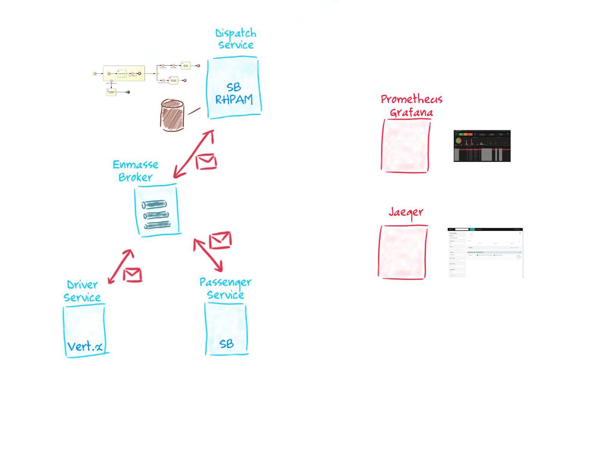

*Message data model*

The message payload is kept deliberately very simple. Messages are JSON objects, with a generic structure:

----
{
  "messageType": "RideRequestedEvent",
  "id": "19ad5b0b-286b-41bb-86e3-474fbff0a3aa",
  "traceId": "907b52ca-5fe1-4f89-909f-79803eb6af62",
  "sender": "PassengerService",
  "timestamp": 1521148332397",
  "payload":{}
 }
----

* messageType: the type of the message. In general a distinction is made between Commands and Events. Commands tell the recipient to do something (e.g. _AssignDriverCommand, HandlePaymentCommand_). Events inform interested parties that something happened, so that they can act on it (_DriverAssignedEvent, RideStartedEvent_).
* id: unique id per message.
* traceId: unique id that is passed along with messages through the entire functional message flow.For tracing purposes.
* sender: originating service
* timestamp: timestamp when the message was created
* payload: a JSON object representing the proper payload of the message. This will be different depending on the message type.

In the lab, we'll implement the following message flows:

image::images/rhte-message-flow.png[]

*Topics*

AMQ 7 has a powerful and flexible addressing model, that comprises three main concepts: addresses, queues and routing types. An address represents a messaging endpoint. Within the configuration, an address is given a unique name, 0 or more queues, and a routing type. +
The routing type determines how messages are distributed amongst its queues.

* _anycast_: messages are routed to a single queue within the matching address, in a point-to-point manner.
* _multicast_ : messages are routed to every queue within the matching address, in a publish-subscribe manner.

image::images/artemis_addressing_anycast.png[]

image::images/artemis_addressing_multicast.png[]

The AMQ 7 address model maps nicely to the JMS concepts of queues and topics.

For an event-driven system as the one that is implemented in this lab, pubish/subscribe topics is generally what you want, as there are typically several services that are interested in a particular type of event. How to map event types to topics? This can vary from 1 topic for all event types to a separate topic per event type, or any variations in between. For the lab, we tried to segment per domain and per event class (event or command). So we ended up with 5 topics: _topic-ride-event_, _topic-driver-command_, _topic-driver-event_, _topic-passenger-command_ and _topic-passenger-event_. +
The downside of this approach is that message consumers need to filter on the specific event types that they are interested in.

*Messaging Protocol*

All services in the application use the AMQP protocol over SSL/TLS (amqps) for communication with the broker. We use one-way SSL - the clients authenticate with username/password.

== Lab Material

The lab material is hosted on GitHub, at the following URL:

`https://github.com/gpte-rhte2018-msa-orchestration`

The material consists of a number of git repositories:

* *dispatch-service* : the source code for the dispatch service.
* *driver-service* : the source code for the driver service.
* *passenger-service* : the source code for the passenger service.
* *dispatch-service-kjar* : a kjar that contains the process definition used in the dipatch service. Note that in this lab we do not use this kjar - the process definition was copied into the dispatch service.
* *installation* : Ansible playbooks to install the different components on OpenShift and OPenShift resource files.
* *soapui* : SoapUI project to generate load in the system.

Create a folder on your workstation, and using `git`, clone the different projects into the folder.

NOTE: We highly encourage you to review the source code of the different services. However, please do not import the source code into an IDE during this lab (a text editor like Atom or Sublime is fine). Doing so will cause the IDE to try to build the code, and start downloading missing Maven dependencies. Considering the number of participants in this lab today, this will consume way too much bandwith.

== Code Walkthrough

=== Process Definition

The orchestration logic in the Dispatch service is implemented as a BPMN2 process. From a functional point of view, the orchestration is as follows:

* The Dispatch service receives a _RideRequestedEvent_ message from the _topic-ride-event_ topic.
* A _DispatchDriverCommand_ is sent to the _topic-driver-command_ topic.
* The service waits for a _DriverDispatchedEvent_ from the _topic-driver-event_ topic.
* If a _DriverDispatchedEvent_ is not received within 5 minutes, the state of the Ride is set to _expired_. A _RideExpiredEvent_ is sent to the _topic-ride-event_ queue.
* As long as the ride did not start, the passenger can cancel the ride. The service waits on a _RideCanceledEvent_ from the _topic-ride-event_ topic, or a _RideStartedEvent_ form the _driver-event-topic_, whichever comes first.
* If a _RideCanceledEvent_ is received, the status of the ride is set to _canceled_. +
The passenger will have to pay a penalty (this part is not implemented)
* If a _RideStartedEvent_ is received, the status of the ride is set to
_started_ and the service waits for a _RideEndedEvent_.
* If a _RideEndedEvent_ is received, a _HandlePaymentCommand_ message is sent to the _topic-passenger-command_ topic. The status of the ride is set to _ended_.

Note that several other use cases are currently not implemented in the lab:

* The driver can cancel a ride
* The passenger can cancel a ride before the ride is assigned to a driver.

The process diagram looks like:

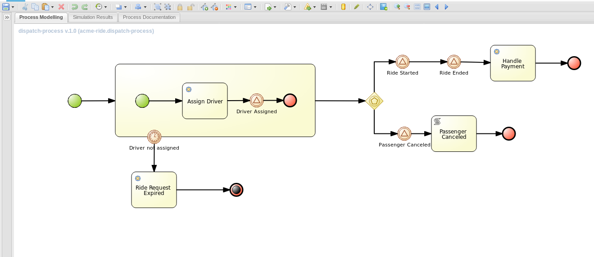

* _Signal_ event nodes are used to model the fact that the process is waiting for a certain type of message. When the service receives a message, it finds the relevant process instance, and signals the process. +
From a conceptual view it would have been more logical to use BPMN _Message_ event nodes rather than signal nodes. However, Message event nodes are broken in the current version of RHPAM (will be fixed in the next release).
* Signal nodes are wait states, so at each signal the state of the process instance is saved in the database.
* The data model for the process is very simple: the process instance only keeps track of the _rideId_ and the _traceId_ for the ride. The _assign_driver_expire_duration_ process variable is the delay after which the timer fires.
+
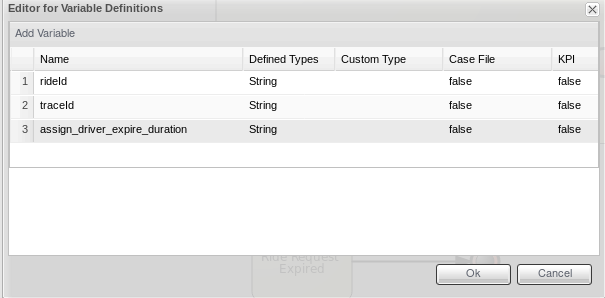
+
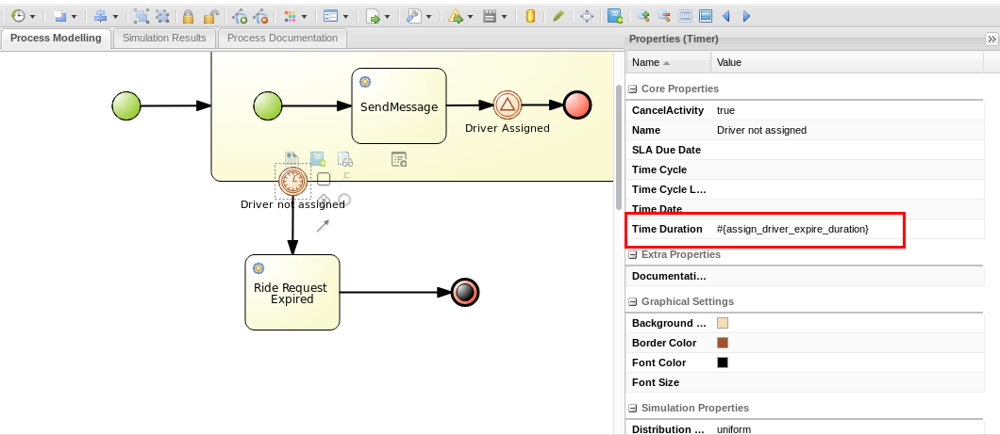
* The process uses two custom _WorkItemHandlers_.
** The _Assign Driver_ and _Handle Payment_ nodes use the _SendMessage_ WorkItemHandler. The implementation sends a message of particular type to a particular destination.
+
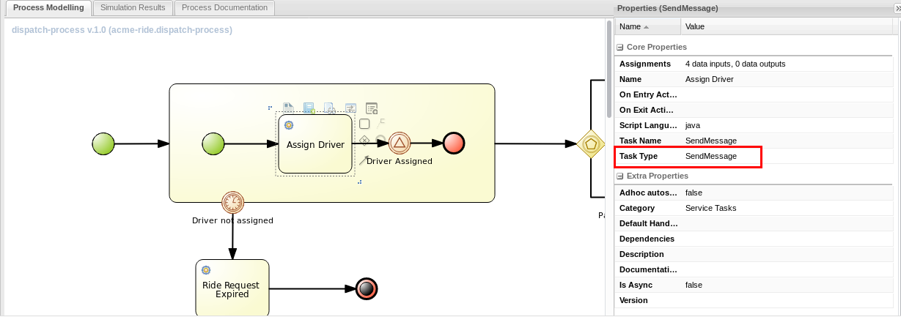
+
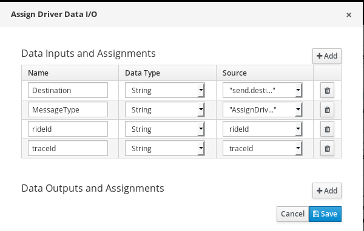
** The _Ride Request Expired_ node uses the _UpdateRide_ WorkItemHandler, whose implementation updates the status of the Ride entity.
+
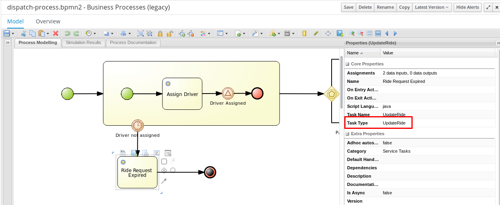
+
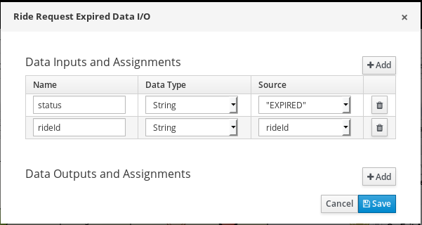

=== Data model

TODO

=== RHPAM engine embedded in Spring Boot application

TODO

=== Passenger service - Messaging with Spring Boot

The passenger service is implemented with Spring Boot. Actually this is not a real implementation of business functionality, but rather a service mock.

The implementation is very simple. The application exposes a REST endpoint, which when called will send 1 or more `RideRequestedEvent` messages to the `topic-ride-event` topic. There is additional logic to support the passenger cancelation scenario. In that case a `PassengerCanceledEvent` message is sent to to the `topic-passenger-event` when a `DriverAssignedEvent` message has been received from the `topic-driver-event` topic.

AMQP messaging on Spring Boot is made easy with the `amqp-10-jms-spring-boot-starter` component. This component provides auto-configuration of a JMS ConnectionFactory using the Qpid JMS AMQP 1.0 client as the underlying transport. The QPID JMS AMQP 1.0 library provides a JMS API on top of the AMQP protocol, which allows to use familiar JMS APIs on top of AMQP. The latest version of the `amqp-10-jms-spring-boot` component has built-in support for JMS resource pooling.

The Spring framework has excellent support for JMS. It provides the `JMsTemplate` to easily send messages and the `@JmsListener` annotation to mark methods as message consumers.

The `amqp-10-jms-spring-boot` autostarter is configured with properties (`amqphub.amqp10jms.\*` and `amqphub.amqp10jms.pool.\*`). For the use case in the lab some additional configuration is required to support transacted sessions, and shared, durable subscribers. This is done in the `PassengerServiceJmsConfiguration` class, which provides custom configured instances of `JMSTemplate` and `DefaultJmsListenerContainerFactory`:

----
    @Bean
    public DefaultJmsListenerContainerFactory jmsListenerContainerFactory(
            DefaultJmsListenerContainerFactoryConfigurer configurer,
            ConnectionFactory connectionFactory) {
        DefaultJmsListenerContainerFactory factory = new DefaultJmsListenerContainerFactory();
        factory.setSubscriptionShared(subscriptionShared);
        factory.setSubscriptionDurable(subscriptionDurable);
        configurer.configure(factory, connectionFactory);
        return factory;
    }

    @Bean
    public JmsTemplate jmsTemplate(ConnectionFactory connectionFactory) {
        JmsTemplate jmsTemplate = new JmsTemplate(connectionFactory);
        jmsTemplate.setPubSubDomain(this.jmsProperties.isPubSubDomain());
        jmsTemplate.setSessionTransacted(transacted);
        return jmsTemplate;
    }
----

Sending messages is simply a matter of using the appropriate method on the `JMSTemplate` instance. If the payload is `String`, a JMS `TextMessage` is sent.

----
    @Autowired
    private JmsTemplate jmsTemplate;

    @Value("${sender.destination.ride-requested}")
    private String destination;

    public void send(Message<RideRequestedEvent> msg) {
        try {
            String json = new ObjectMapper().writeValueAsString(msg);
            jmsTemplate.convertAndSend(destination, json);
            log.debug("Sent 'RideRequestedEvent' message for ride " + msg.getPayload().getRideId());
        } catch (JsonProcessingException e) {
            log.error("Error transforming message to json " + msg, e);
            throw new RuntimeException(e);
        }
    }
----

To consume messages, a method is annotated with `@JmsListener` specifying the destination name, and the subscription name in case of shared and/or durable subscriptions. The method will be called whenever a message is consumed from the topic or queue, with the payload of the message (a `String` in the case of a `TextMessage`) as parameter.

----
    @JmsListener(destination = "${listener.destination.driver-assigned}", subscription= "${listener.subscription.driver-assigned}")
    public void processMessage(String messageAsJson) {

        [...]
    }
----

The `spring.jms.listener.concurrency` and `spring.jms.listener.max-concurrency` properties in the application configuration define the pool settings for the message consumers.

=== Driver service - Messaging with Vert.x

The driver service is implemented in Vert.x. Actually this is not a real implementation of business functionality, but rather a service mock.

The implementation is quite simple. The service listens for `AssignDriverCommand` messages on the `topic-driver-command` topic. Upon consumption of a message, it sends a `DriverAssignedEvent` to the `topic-driver-event` queue. After a random delay a `RideStartedEvent` message is sent to the `topic-ride-event` topic. After another delay, a `RideEndedEvent` is sent to the `topic-ride-event` topic. +
There is some additional logic to support other scenario's (passenger cancels the ride, driver cannot be assigned).

There is no particular reason to use Vert.x for the implementation, other than that it gives the opportunity to experiment with messaging on Vert.x

From a architectural point of view, the application is composed of four verticles:

* MessageConsumerVerticle: listens for messages on the `topic-driver-command` queue.
* MessageProducerVerticle: sends messages to the `topic-driver-event` and `topic-ride-event` topics.
* MainVerticle: application starting point, manages the lifecycle of the other verticles.
* RestApiVerticle: implements the REST endpoint for the health check.

The ConsumerVerticle and ProducerVerticle communicate over the Vert.x event bus.

Vert.x provides the Vert.x AMQP Bridge component, which provides AMQP 1.0 producer and consumer support via a bridging layer implementing the Vert.x event bus MessageProducer and MessageConsumer APIs on top of Vert.x Proton. Vert.x proton is a thin wrapper over the Apache Qpid Proton AMQP 1.0 library. +
In other words, if you use the AMQP Bridge component, once the bridge is set up, as a developer you can use the simple Vert.x event bus API to consume and send messages, without having to deal with the lower level Qpid Proton APIs.

The AMQP bridge is configured in the `start` method of the `ConsumerVerticle`:

----
    @Override
    public void start(Future<Void> startFuture) throws Exception {
        AmqpBridgeOptions bridgeOptions = new AmqpBridgeOptions();
        //Handle SSL
        bridgeOptions.setSsl(config().getBoolean("amqp.ssl"));
        bridgeOptions.setTrustAll(config().getBoolean("amqp.ssl.trustall"));
        bridgeOptions.setHostnameVerificationAlgorithm(!config().getBoolean("amqp.ssl.verifyhost") ? "" : "HTTPS");
        bridgeOptions.setReplyHandlingSupport(config().getBoolean("amqp.replyhandling"));
        // Java Truststore
        if (!bridgeOptions.isTrustAll()) {
            JksOptions jksOptions = new JksOptions()
                    .setPath(config().getString("amqp.truststore.path"))
                    .setPassword(config().getString("amqp.truststore.password"));
            bridgeOptions.setTrustStoreOptions(jksOptions);
        }
        // Create the bridge
        bridge = AmqpBridge.create(vertx, bridgeOptions);
        String host = config().getString("amqp.host");
        int port = config().getInteger("amqp.port");
        String username = config().getString("amqp.user", "anonymous");
        String password = config().getString("amqp.password", "anonymous");
        //Start the bridge
        bridge.start(host, port, username, password, ar -> {
            if (ar.failed()) {
                log.warn("Bridge startup failed");
                startFuture.fail(ar.cause());
            } else {
                log.info("AMQP bridge to " + host + ":" + port + " started");
                bridgeStarted();
                startFuture.complete();
            }
        });
    }
----

Once the bridge is started, a consumer is created. The consumer is associated with a handler which is called when the consumer receives an AMQP message. The AMQP message is automatically transformed to a Vert.x `Message<JsonObject>` by the AMQP bridge:

----
    private void bridgeStarted() {
        MessageConsumer<JsonObject> consumer = bridge.<JsonObject>createConsumer(config().getString("amqp.consumer.driver-command"))
                .exceptionHandler(this::handleExceptions);
        consumer.handler(this::handleMessage);
    }

    private void handleMessage(Message<JsonObject> msg) {
        [...]
    }
----

The different elements of the JSON object correspond to various sections of the AMQP message:

----
{
  "body": "{\"messageType\":\"AssignDriverCommand\",\"id\":\"cb2b7216-832c-4b28-86eb-981ec3dd2637\",\"traceId\":\"03af65ee-d7c2-43ef-a9cb-343c519137cb\",\"sender\":\"DispatchService\",\"timestamp\":1535012681551,\"payload\":{\"rideId\":\"f7b32455-86da-46a5-9263-221f6d96459d\",\"pickup\":\"North Carolina Museum Of Art, Raleigh, NC 27607\",\"destination\":\"Wake Forest Historical Museum, Wake Forest, NC 27587\",\"price\":26.89,\"passengerId\":\"passenger188\"}}",
  "body_type": "value",
  "properties": {
    "to": "topic-driver-command",
    "message_id": "ID:e8dc2474-4de3-4a6f-91fc-cc28ce2d1ac6:1:1:1-4",
    "creation_time": 1535012681553
  },
  "header": {
    "durable": true
  },
  "application_properties": {
    "uber_$dash$_trace_$dash$_id": "36648af51f2072e3:d653a01c524925f9:c10319c831379c4e:1"
  },
  "message_annotations": {
    "x-opt-jms-dest": 1,
    "x-opt-jms-msg-type": 5
  }
}
----

In the ProducerVerticle, the brige is initialized in the same way. Producers are registered with the bridge as follows:

----
    private void bridgeStarted() {
        driverEventProducer = bridge.<JsonObject>createProducer(config().getString("amqp.producer.driver-event")).exceptionHandler(this::handleExceptions);
        rideEventProducer = bridge.<JsonObject>createProducer(config().getString("amqp.producer.ride-event")).exceptionHandler(this::handleExceptions);
        vertx.eventBus().consumer("message-producer", this::handleMessage);
    }
----

The producer takes a `JsonObject` as payload. The structure of the JsonObject should reflect the structure of the AMQP message.

----
    private void sendMessageToTopic(JsonObject body, MessageProducer<JsonObject> messageProducer) {
        JsonObject amqpMsg = new JsonObject();
        amqpMsg.put(AmqpConstants.BODY_TYPE, AmqpConstants.BODY_TYPE_VALUE);
        amqpMsg.put(AmqpConstants.BODY, body.toString());
        JsonObject annotations = new JsonObject();
        byte b = 5;
        annotations.put("x-opt-jms-msg-type", b);
        amqpMsg.put(AmqpConstants.MESSAGE_ANNOTATIONS, annotations);
        messageProducer.send(amqpMsg);
    }
----

The `x-opt-jms-msg-type` AMQP message annotation is meant for consumers of this message. If the consumer uses the Apache QPID JMS client - as is the case with the passenger service and the driver service - the `x-opt-jms-msg-type`
annotation determines how the AMQP message will be transformed to a JMS message. If the annotation is set and its value is 5, the AMQP message will be consumed as a JMS `TextMessage` rather than the default `ObjectMessage`.

The Vert.x AMQP bridge is pretty convenient, and easy to use. The biggest downside is that is does not support all the messaging styles that a JMS 2.0 client supports. For example, there is no support for shared or durable subscriptions. +
In practice this means that scaling out consumers is problematic, as all instances will receive all the messages
posted on a topic and so your consumers must be idempotent. And when the instance dies, messages will be lost.

Some ways to work around this :

* Use the AMQP client APIs directly rather than the abstractions provided by the Vert.x AMQP bridge and Vert.x Proton. Note that these low-level APIs are not necessarily easy to work with.
* Use Artemis broker server side configuration to preconfigure queues with public-subscribe behaviour (more details at https://activemq.apache.org/artemis/docs/2.0.0/address-model.html)
* Use QPID JMS rather than Vert.x AMQP bridge.

== Provisioning on OpenShift

=== EnMasse Messaging

As mentioned above, EnMasse comes with two address spaces, standard and brokered. In this lab, we use a brokered address space.

EnMasse also requires at least one authentication service to be deployed. The authentication service can be _none_, _standard_ or _external_. +
The _standard_ authentication service leverages Keycloak (the upstream project of Red Hat SSO).
The _none_ authentication service is an allow-all mocked out authentication service.

For this lab we will use the none authentication service. The main reason is that the capacity of the environment in OpenShift is limited, and the none authentication service pod is a lot easier on resources compared to Keycloak.

You will find here two alternatives to provision EnMasse in the OpenShift environment, manual or through an Ansible playbook. The manual method only requires the OpenShift `oc` command line client. The Ansible playbook requires ansible, and the `oc` client. You also need `openssl` to generate certificates.

==== EnMasse installation

. Make sure you are logged with the `oc` client into your OpenShift environment.
. In a terminal, change directory to the folder where you cloned the `installation` project of the lab material.
. Create a project on OpenShift. The project name has to be unique within the OpenShift cluster, so use `enmasse-` suffixed with your name or another unique identifier.
+
----
$ export $ENMASSE_PRJ=enmasse-<unique suffix>
$ oc new-project $ENMASSE_PRJ
----
* Note the usage of the `ENMASSE_PRJ` environment variable. As long as you stay in the same terminal window, you can reuse the environment variable in other commands. This should make copy-paste from the lab instructions more convenient.
. Create service accounts for the EnMasse address space controller and agent controller:
+
----
$ oc create sa enmasse-admin -n $ENMASSE_PRJ
$ oc create sa address-space-admin -n $ENMASSE_PRJ
----
. Give project admin rights to the `enmasse-admin` and `address-space-admin` service accounts
+
----
$ oc adm policy add-role-to-user admin system:serviceaccount:$ENMASSE_PRJ:enmasse-admin -n $ENMASSE_PRJ
$ oc adm policy add-role-to-user admin system:serviceaccount:$ENMASSE_PRJ:address-space-admin -n $ENMASSE_PRJ
----
. Create a self-signed certificate for the `none` authentication service
+
----
$ openssl genrsa -out /tmp/none-auth.ca.key 2048
$ openssl req -new -x509 -days 1100 -key /tmp/none-auth.ca.key -subj "/O=io.enmasse/CN=none-authservice.$ENMASSE_PRJ.svc.cluster.local" -out /tmp/none-auth.ca.crt
$ openssl req -newkey rsa:2048 -nodes -keyout /tmp/none-auth.key -subj "/O=io.enmasse/CN=none-authservice.$ENMASSE_PRJ.svc.cluster.local" -out /tmp/none-auth.csr
$ openssl x509 -req -extfile <(printf subjectAltName=DNS:none-authservice.$ENMASSE_PRJ.svc.cluster,DNS:none-authservice.$ENMASSE_PRJ.svc,DNS:none-authservice) -days 1100 -in /tmp/none-auth.csr -CA /tmp/none-auth.ca.crt -CAkey /tmp/none-auth.ca.key -CAcreateserial -CAserial /tmp/none-auth.srl -out /tmp/none-auth.crt
----
. Create a secret with the certificate and the private key:
+
----
$ oc create secret tls none-authservice-cert --cert="/tmp/none-auth.crt" --key="/tmp/none-auth.key" -n $ENMASSE_PRJ
----
. Create the `none` authentication service.
+
----
$ oc apply -f openshift/enmasse/none-authservice/service.yaml -n $ENMASSE_PRJ
$ oc apply -f openshift/enmasse/none-authservice/deployment.yaml -n $ENMASSE_PRJ
----
. Create a self-signed certificate for the EnMasse broker
+
----
$ openssl genrsa -out /tmp/messaging.ca.key 2048
$ openssl req -new -x509 -days 1100 -key /tmp/messaging.ca.key -subj "/O=io.enmasse/CN=messaging.$ENMASSE_PRJ.svc.cluster.local" -out /tmp/messaging.ca.crt
$ openssl req -newkey rsa:2048 -nodes -keyout /tmp/messaging.key -subj "/O=io.enmasse/CN=messaging.$ENMASSE_PRJ.svc.cluster.local" -out /tmp/messaging.csr
$ openssl x509 -req -extfile <(printf subjectAltName=DNS:messaging.$ENMASSE_PRJ.svc.cluster.local,DNS:messaging.$ENMASSE_PRJ.svc.cluster,DNS:messaging.$ENMASSE_PRJ.svc,DNS:messaging) -days 1100 -in /tmp/messaging.csr -CA /tmp/messaging.ca.crt -CAkey /tmp/messaging.ca.key -CAcreateserial -CAserial /tmp/messaging.srl -out /tmp/messaging.crt
----
. Create a secret with the certificate and the private key:
+
----
$ oc create secret tls external-certs-messaging --cert="/tmp/messaging.crt" --key="/tmp/messaging.key" -n $ENMASSE_PRJ
----
. Create the brokered plan and resource configuration
+
----
$ oc apply -f openshift/enmasse/resource-definitions/resource-definitions.yaml -n $ENMASSE_PRJ
$ oc apply -f openshift/enmasse/plans/brokered-plans.yaml -n $ENMASSE_PRJ
----
. Deploy the address space controller
+
----
$ oc apply -f openshift/enmasse//address-space-controller/address-space-definitions.yaml -n $ENMASSE_PRJ
$ oc apply -f openshift/enmasse//address-space-controller/deployment.yaml -n $ENMASSE_PRJ
----
. Wait until the address controller pod is up and running. In the OpenShift console, the EnMasse project looks like:
+
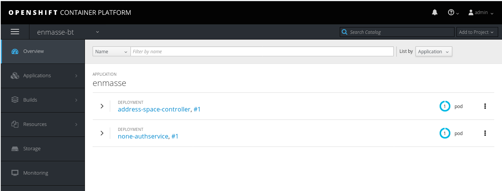
. Create the address space.
+
----
$ oc process -f openshift/enmasse/templates/address-space.yaml -p NAME=brokered-default -p NAMESPACE=$ENMASSE_PRJ -p TYPE=brokered -p PLAN=unlimited-brokered -p AUTHENTICATION_SERVICE=none | oc apply -n $ENMASSE_PRJ -f -
----
* This command creates a configmap with the address space definition in the enmasse project. The EnMasse address controllers watches the configmaps in the project, and upon discovery of a address space definition configmap will proceed and deploy the address space.
* In the case of a brokered address space, a single Artemis broker pod is deployed, as well as an address controller pod.
* The role of the address controller is equivalent to that of the address space controller, but for addresses: the controller watches configmaps in the namespace, and on detection of a address configuration configmap, proceeds to create the address on the broker. The address controller also hosts the EnMasse console.
. Wait until the broker and address controller pods are up and running. In the OpenShift console, the EnMasse project looks like:
+
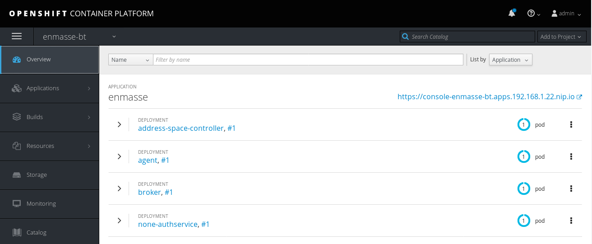
. Create the address for the `topic-ride-event` topic. One way to create addresses in EnMasse is by creating a configmap.
+
----
$ oc process -f openshift/enmasse/templates/address.yaml -p NAME=topic-ride-event -p ADDRESS=topic-ride-event -p NAMESPACE=$ENMASSE_PRJ -p ADDRESS_SPACE=brokered-default -p TYPE=topic -p PLAN=brokered-topic | oc apply -n $ENMASSE_PRJ -f -
----
+
* You can check that the creation of the address by looking at the contents of the configmap. If successful, the address controller adds `"status":{"isReady":true,"phase":"Active"}` to the JSON object in the configmap.
+
----
$ oc get configmap topic-ride-event -o template --template={{.data}} -n $ENMASSE_PRJ
----
+
.Sample Output
----
map[config.json:{"apiVersion":"enmasse.io/v1","kind":"Address","metadata":{"name":"topic-ride-event","namespace":"enmasse-bt","addressSpace":"brokered-default"},"spec":{"address":"topic-ride-event","type":"topic","plan":"brokered-topic"},"status":{"isReady":true,"phase":"Active"}}]
----
. Another way to create addresses is through the EnMasse web console.
* Get the URL of the console:
+
----
$ echo "https://$(oc get route console -o template --template {{.spec.host}} -n $ENMASSE_PRJ)"
----
* Alternatively, obtain the URL from route definition in the OpenShift console
* In a web browser navigate to the URL of the console. Accept the security exception for using self-signed certificates. The landing page of the console opens:
+
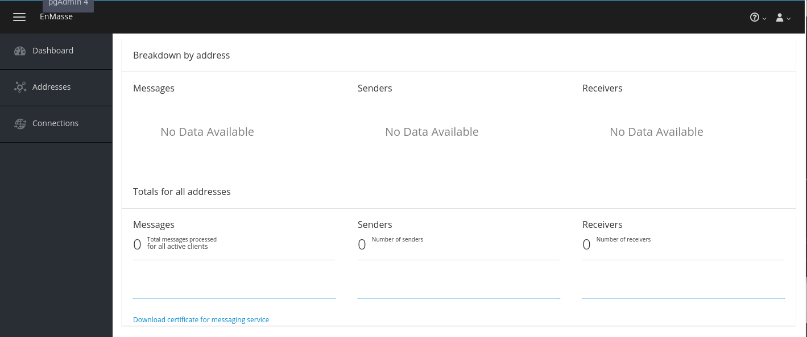
* Note that no login is required. This is because we use the `none` authentication service.
* Proceed to the `Addresses` tab. Click on the `Create` button at the top of the screen.
** Name the topic `topic-driver-command`, and seletc `topic` as the type.
** Click `Next` twice, and finally `Create` to create the address. The address is added to the addresses list in the console.
. Make sure you create the following addresses:
+
[cols="2",options="header"]
|=======================================
|Name|Type
|topic-ride-event|topic
|topic-driver-command|topic
|topic-driver-event|topic
|topic-passenger-command|topic
|topic-passenger-event|topic
|=======================================
+
image::images/enmasse_console_addresses.png[]

==== EnMasse Ansible installation

If you have Ansible installed, you can run the Ansible playbook provided in the lab material. The playbook performs the same steps as the manual install, including creating the address space and the addresses required for the lab.

. Make sure you are logged with the `oc` client into your OpenShift environment.
. In a terminal, change directory to the folder where you cloned the `installation` project of the lab material.
. Run the EnMasse playbook. Provide the name of the project where to install EnMasse as a parameter to the playbook. Remember, the project name should be unique within the cluster.
+
----
$ ENMASSE_PRJ=enmasse-<unique suffix>
$ cd ansible
$ ansible-playbook playbooks/enmasse.yml -e project_enmasse=$ENMASSE_PRJ
----
. Expect the playbook to run to completion without failures. Expected failures during the execution of the playbook are ignored by the playbook. What matters is that the `PLAY RECAP` summary at the end of the playbook output shows no failures.
+
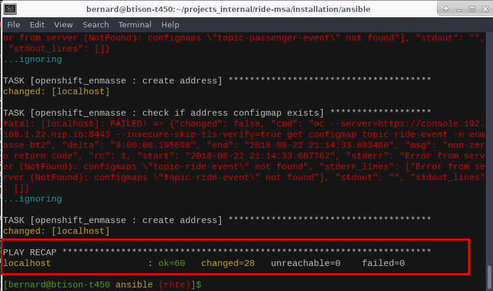
. In the case of an unexpected failure, try to find the root cause, and fix it. Run the playbook again. The playbook is idempotent, so it can be run several times if needed.
. Once the playbook has run successfully, check through the OPenShift Web Console and the EnMasse console that everything went as expected.

==== Installation review

Take a moment to review the EnMasse installation:

*Deployments*

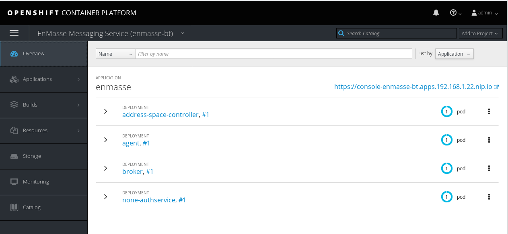

* address-space controller : manages address spaces.
* agent: manages addresses. Hosts the EnMasse console.
* broker: instance of a AMQ 7 broker. In the case of a standard address space, there is a single broker instance.
* none-authservice: the authentication service.

*Routes*

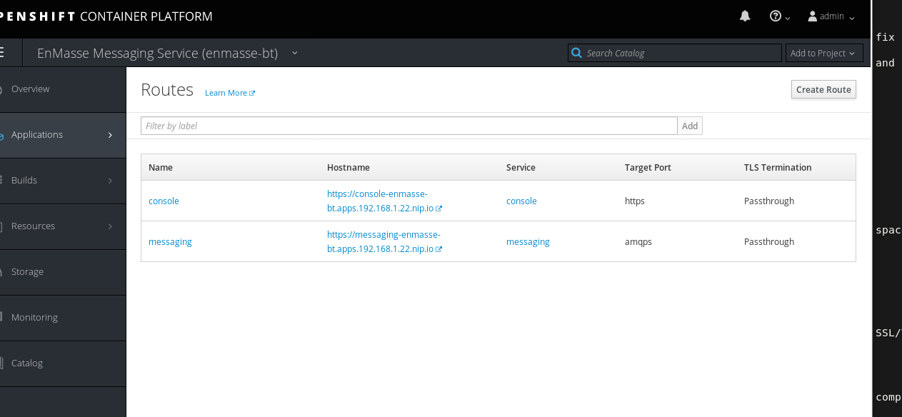

* console : route exposing the EnMasse console. Forwarded to the console service.
* messaging : external messaging route. Supports AMQP and OPENWIRE over SSL/TLS (amqps). Forwarded to the messaging service. When connecting a client from outside of OpenShift to the EnMasse broker, the connection URL will be something like `amqps://messaging-<enmasse-namespace>.<ocp-domain>:443` when using AMQP.

*Services*

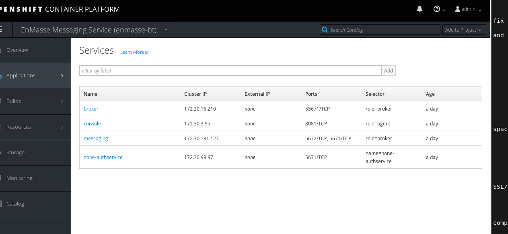

* broker : port 55671 - used for internal communication between EnMasse components
* console : exposes the EnMasse console.
* messaging : port 5671 and 5672. Messaging clients connect to this service. Port 5672 supports AMQP, CORE, OPENWIRE, MQTT protocols. Port 5671 supports AMQP, CORE, OPENWIRE, MQTT over SSL.
* none-authservice : exposes the none-authentication service to EnMasse components.

*Storage*

The broker has a persistent volume mounted to `/var/run/artemis`. The broker configuration and journal is written to that persistent volume. Each broker pod gets its own directory (`/var/run/artemis/split-1` for the first one and so on). This means that the broker can be scaled up. However scaling down is not supported at the moment.

*Configmaps*

Note that every address has a configmap with labels `app=enmasse,type=address-config`. The agent watches configmaps with these labels and creates, removes or updates addresses on the broker whenever a configmap is created, deleted or updated.

*Secrets*

The `external-certs-messaging` secret holds the server-side certificate and private key for SSL connection with messaging clients over port 5671.

=== Tools

Before we can start deploying the services that make up the application, we need to install some tools:

* Gogs: a lightweight Git server written in Go.
* Jenkins: the ubiquitous continuous integration server
* pgAdmin4: an open source web based administration and development platform for PostgreSQL

Just as with EnMasse, you have the choice between manual installation, or
Ansible playbooks.

==== Gogs installation

. Make sure you are logged with the `oc` client into your OpenShift environment.
. In a terminal, change directory to the folder where you cloned the `installation` project of the lab material.
. Create a project on OpenShift. The project will be used for the different tools we need to install. The project name has to be unique within the OpenShift cluster, so use `tools-` suffixed with your name or another unique identifier.
+
----
$ export TOOLS_PRJ=tools-<unique suffix>
$ oc new-project $TOOLS_PRJ
----
. Obtain the name of your Openshift domain.
+
----
$ oc create route edge testroute --service=testsvc --port=80 -n $TOOLS_PRJ
$ DOMAIN=$(oc get route testroute -o jsonpath='{.spec.host}' -n $TOOLS_PRJ | sed "s/testroute-${TOOLS_PRJ}.//g")
$ oc delete route testroute -n $TOOLS_PRJ
----
. Deploy Gogs using the template in the `openshift/gogs` folder:
+
----
$ oc process -f openshift/gogs/gogs-persistent-template.yaml --param=APPLICATION_NAME=gogs --param=HOSTNAME=gogs-$TOOLS_PRJ.$DOMAIN --param=GOGS_VERSION=0.11.34 --param=DATABASE_USER=gogs --param=DATABASE_PASSWORD=gogs --param=DATABASE_NAME=gogs --param=SKIP_TLS_VERIFY=true | oc create -f - -n $TOOLS_PRJ
----
* Note that the deployment for the gogs server is paused.
. Wait until the PostgreSQL pod is up and running.
. Resume the `gogs` deployment:
+
----
$ oc rollout resume dc/gogs -n $TOOLS_PRJ
----
. Get the URL for the `gogs` route:
+
----
$ echo "http://$(oc get route gogs -o jsonpath='{.spec.host}' -n $TOOLS_PRJ)"
----
. In a web browser window, navigate to the gogs URL. Expect to see the Gogs landing page.
+
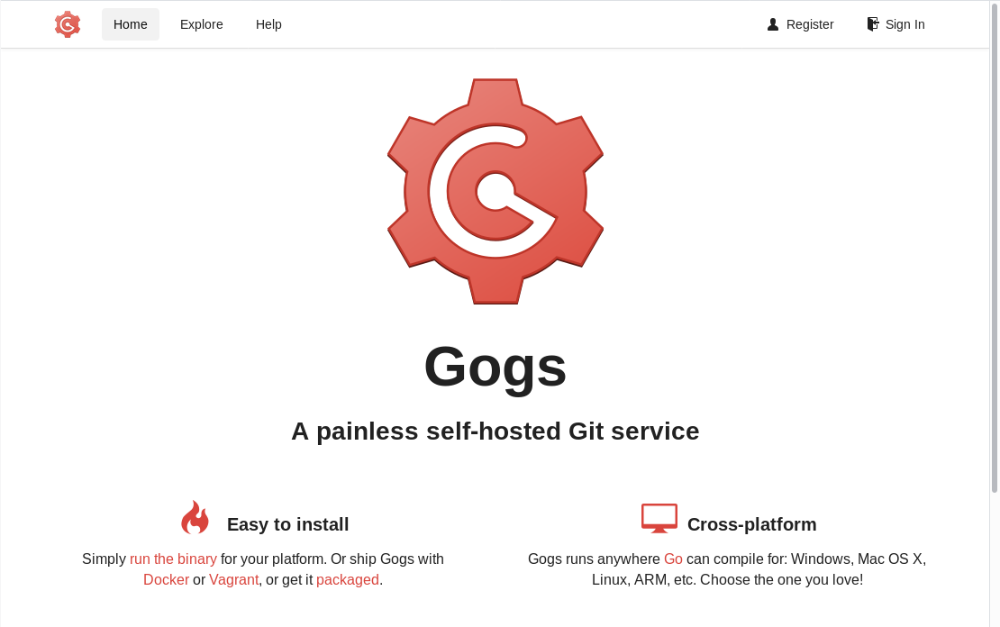
. Create an admin user - the first user created on Gogs has admin privileges:
* Click on the `Register` link on top of the page.
* In the Sign Up form, fill in the following data:
** Username: gogsadmin
** Email: admin@acme.com
** Password: admin123
** Re-type: admin123
* Click `Create new Account`.
. Create a developer account:
* Click on the `Register` link on top of the page.
* In the Sign Up form, fill in the following data:
** Username: developer
** Email: developer@acme.com
** Password: developer123
** Re-type: developer123
* Click `Create new Account`.
. Sign in as `developer`, and create a new organization called `acme`. You will use this organization to host the application source code.

==== Gogs Ansible installation

If you have Ansible installed, you can run the Ansible playbook provided in the lab material. The playbook executes the same steps as the manual install, including creating the admin user (`gogsadmin/admin123`), developer user (`developer/developer123`) and organization (`acme`).

. Make sure you are logged with the `oc` client into your OpenShift environment.
. In a terminal, change directory to the folder where you cloned the `installation` project of the lab material. Change directory to the `ansible` folder.
. Run the Gogs playbook. Provide the name of the project where to install Gogs and the other tools as a parameter to the playbook. Remember, the project name should be unique within the cluster.
+
----
$ TOOLS_PRJ=tools-<unique suffix>
$ cd ansible
$ ansible-playbook playbooks/gogs.yml -e project_tools=$TOOLS_PRJ
----
. Expect the playbook to run to completion without failures.
+
image::images/gogs_ansible_playbook.png[]

==== pgAdmin4 installation

We use an image from https://www.crunchydata.com[CrunchyData], a US based company offering services around enterprise deployments of PostgreSQL.

. Make sure you are logged with the `oc` client into your OpenShift environment.
. In a terminal, change directory to the folder where you cloned the `installation` project of the lab material.
. Create a secret for the pgAdmin4 username and password
+
----
$ oc create secret generic pgadmin4-credentials --from-literal=pgadmin4.username=admin@example.com --from-literal=pgadmin4.password=admin123 -n $TOOLS_PRJ
----
. Deploy a service, route and deployment for pgAdmin:
+
----
$ oc apply -f openshift/pgadmin4/deployment.yaml -n $TOOLS_PRJ
----
. Get the URL for the `pgadmin4` route:
+
----
$ echo "http://$(oc get route pgadmin4 -o jsonpath='{.spec.host}' -n $TOOLS_PRJ)"
----
. In a browser window, navigate to the URL of the pgAdmin4 route. Login with `admin@example.com/admin123`. Expect to see the landing page of pgAdmin4.
+
image::images/pgadmin4_landing_page.png[]

==== pgAdmin4 Ansible installation

If you have Ansible installed, you can run the Ansible playbook provided in the lab material. The playbook executes the same steps as the manual install.

. Make sure you are logged with the `oc` client into your OpenShift environment.
. In a terminal, change directory to the folder where you cloned the `installation` project of the lab material. Change directory to the `ansible` folder.
. Run the pgAdmin4 playbook.
+
----
$ cd ansible
$ ansible-playbook playbooks/pgadmin4.yml -e project_tools=$TOOLS_PRJ
----
. Expect the playbook to run to completion without failures.

==== Jenkins installation

Jenkins on OpenShift uses slave build pods to execute the different  steps of a build pipeline. These build pods are spawned on demand, and destroyed after the build is finished. +
The standard Jenkins instance on OpenShift is configured with two build pods, `nodejs` and `maven`. The second one has Maven installed, and can be used to build Maven projects. +
The default Maven build pod has no persistent storage for the local repository. So for every build, all the build and runtime dependencies need to be downloaded all over again. In this lab we are going to configure a custom Maven build pod which has a persistent volume mount to store the local Maven repo. This will drastically improve the build time - except for the first run, which still needs to download all required artifacts. +
Slave build pods can be configured as part of the build pipeline script, or with a configmap. This latter is used in this lab.

. Make sure you are logged with the `oc` client into your OpenShift environment.
. In a terminal, change directory to the folder where you cloned the `installation` project of the lab material.
. Review the `openshift/jenkins/jenkins-maven-slave-configmap.yaml` configmap definition. In particular, pay particular attention to the following points:
* The configmap has a label `jenkins-slave`. The Jenkins Kubernetes plugin watches for configmaps with this label, and when deteced, will configure a slave build pod according to the definition in the configmap.
* The `name` element in the `PodTemplate` definition is the name used to reference the build pod in build pipeline scripts.
* The `volume` element defines a persistent volume to be mounted at `/home/jenkins/.m2/repository`, which corresponds to the location of the local Maven repository in the build pod.
* The `image` element indicates which image to use for the slave pod. In this case we use the image of the regular Maven build pod.
. Create the configmap:
+
----
$ oc create -f openshift/jenkins/jenkins-maven-slave-configmap.yaml -n $TOOLS_PRJ
----
. Create the persistent volume claim for the slave build pod:
+
----
$ oc create -f openshift/jenkins/jenkins-maven-slave-pvc.yaml -n $TOOLS_PRJ
----
. Deploy Jenkins. The template used is identical to the one used by the `Jenkins` entry in the Openshift Catalog.
+
----
$ oc process -f openshift/jenkins/jenkins-persistent.yaml -p MEMORY_LIMIT=1Gi | oc create -f - -n $TOOLS_PRJ
----
. Get the URL for the `jenkins` route:
+
----
$ echo "https://$(oc get route jenkins -o jsonpath='{.spec.host}' -n $TOOLS_PRJ)"
----
. Wait until the Jenkins pod is up and running. In a browser window, navigate to the  URL of the Jenkins route. Accept the security exception. Log in with your Openshift username and password. The first time you login, you need to authorize the Jenkins service account access to your Openshift profile. Click `Allow selected permissions`. You are redirected to the Jenkins landing page.
+
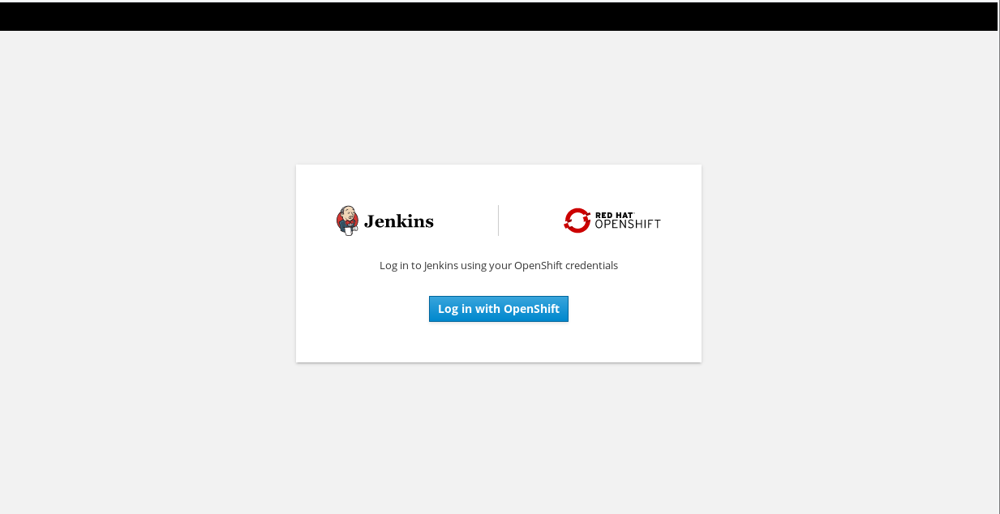
+
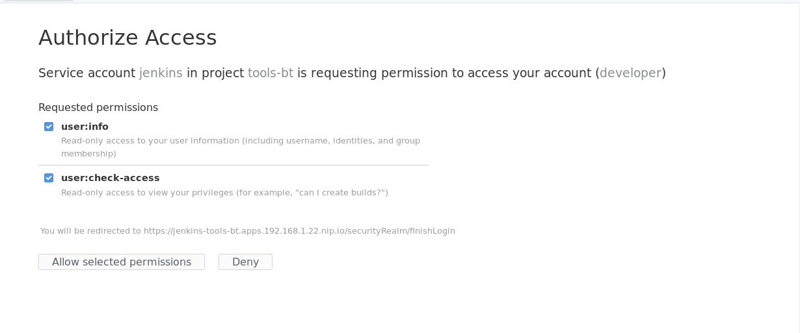
+
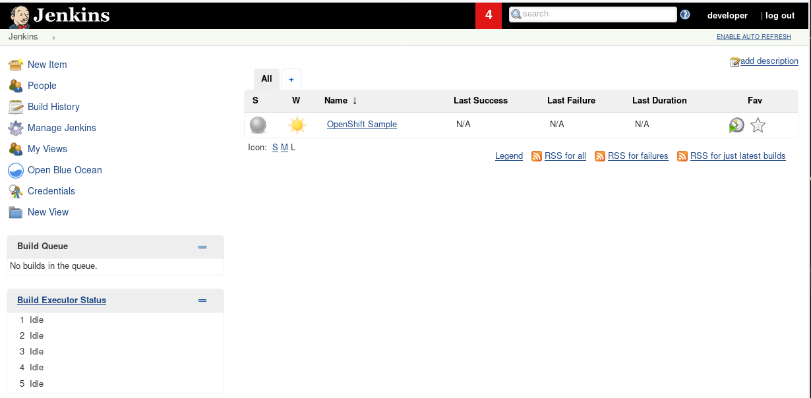
. Verify that the custom slave build pod template has been registered correctly in Jenkins.
* On the landing page, select `Manage Jenkins`.
* On the `Manage Jenkins` page, select `Configure system`.
* Wait for the configuration page to open (this can sometimes take a while), and scroll down until you find the `Kubernetes section`.
* Scroll further down until the `images` section, where you see a listing of the builder pod templates. There should be three templates, `maven`, `nodejs` and `maven-with-pvc`.
* Verify that the `maven-with-pvc` pod template is configured with a persistent volume claim:
+
image::images/jenkins_kubernetes_pod_template_1.png[]
+
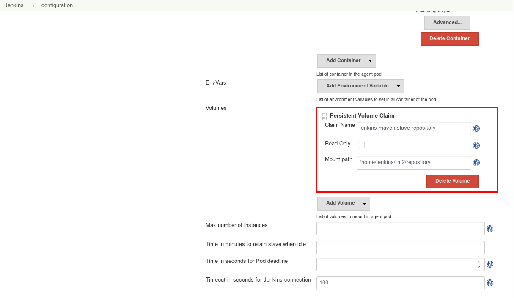

==== Jenkins Ansible installation

If you have Ansible installed, you can run the Ansible playbook provided in the lab material. The playbook executes the same steps as the manual install.

. Make sure you are logged with the `oc` client into your OpenShift environment.
. In a terminal, change directory to the folder where you cloned the `installation` project of the lab material. Change directory to the `ansible` folder.
. Run the Jenkins playbook.
+
----
$ cd ansible
$ ansible-playbook playbooks/jenkins.yml -e project_tools=$TOOLS_PRJ
----
. Expect the playbook to run to completion without failures.

=== Application Services

There are a couple of ways to deploy an application on OpenShift starting from source code.

* Binary build: the application is built locally with the appropriate build tool (Maven, Gradle, ...) and the resulting binary is injected into a OpenShift image using an OpenShift binary build. This is for example the way the Fabric8 Maven Plugin works. +
Very convenient for a developer for testing the application on OpenShift.

* Source-to-image (S2I): the application is build on OpenShift in the runtime image starting from the source code in a Git repository. Once the build is finished, the image is pushed to the OpenShift internal repository and deployed. +
This is an easy way to deploy an application from source code. However there are a number of drawbacks that make this method not really suitable for real world production usage:
** The resulting image contains all the build time dependencies of the application. In the case of for example a Maven build this can quickly add up.
** The S2I build is typically a minimal build. In the case of a Maven build the default Maven command is `mvn package -DskipTests`. Tests are not executed, there is no code quality analysis, etc..

* Build pipeline: a pipeline defines the build process which typically includes several stages for building, testing and delivering the application. The pipeline is executed on a build server. OpenShift provides tight integration with Jenkins, and allows to define build pipelines in an OpenShift buildconfig which will be executed on Jenkins.

In this lab we use Jenkins pipelines to build the application services from source code pulled from the Gogs git repository.

The pipeline used is similar for the different services and looks like:

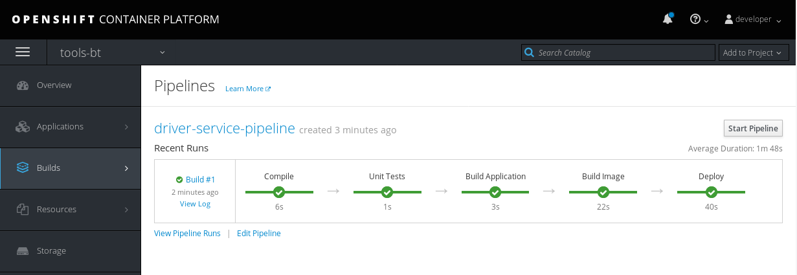

* Compile: The application source code is checked out from the Git repository, followed by a Maven compile step - `mvn clean compile`
* Unit Tests: Maven unit test execution - `mvn test`
* Build Application: builds the binary artifact for the application - `mvn package`
* Build Image: executes a binary Openshift build using the binary application artifact. The image is pushed to the OpenShift registry.
* Deploy: the image is tagged in the services namespace, causing a re(deploy) of the application.

The code of the pipeline:

----
          def git_url = "${GIT_URL}"
          def git_repo_app = "${GIT_REPO}"
          def version = ""
          def groupId = ""
          def artifactId = ""
          def namespace_jenkins = "${JENKINS_PROJECT}"
          def namespace_app = "${APP_PROJECT}"
          def app_build = "${APP_BUILD}"
          def app_imagestream = "${APP_IMAGESTREAM}"
          def app_name = "${APP_DC}"

          node ('maven-with-pvc') {
            stage ('Compile') {
              echo "Starting build"
              git url: "${git_url}/${git_repo_app}", branch: "master"
              def pom = readMavenPom file: 'pom.xml'
              version = pom.version
              groupId = pom.groupId
              artifactId = pom.artifactId
              echo "Building version ${version}"
              sh "mvn clean compile -Dcom.redhat.xpaas.repo.redhatga=true"
            }

            stage ('Unit Tests') {
              sh "mvn test -Dcom.redhat.xpaas.repo.redhatga=true"
            }

            stage ('Build Application') {
              sh "mvn package -DskipTests=true -Dcom.redhat.xpaas.repo.redhatga=true"
            }

            stage ('Build Image') {
              openshift.withCluster() { // Use "default" cluster or fallback to OpenShift cluster detection
                def bc = openshift.selector("bc", "${app_build}")
                def builds = bc.startBuild("--from-file=target/${artifactId}-${version}.jar")
                timeout (15) {
                  builds.watch {
                    if ( it.count() == 0 ) {
                      return false
                    }
                    // Print out the build's name and terminate the watch
                    echo "Detected new builds created by buildconfig: ${it.names()}"
                    return true
                  }
                  builds.untilEach(1) {
                    return it.object().status.phase == "Complete"
                  }
                }
              }
            }

            stage ('Deploy') {
              openshift.withCluster() {
                openshift.withProject( "${namespace_app}") {
                  openshift.tag("${namespace_jenkins}/${app_imagestream}:latest", "${namespace_app}/${app_imagestream}:latest")
                  def dc_app = openshift.selector("dc", "${app_name}")
                  timeout (5) {
                    dc_app.untilEach(1) {
                      return it.object().status.readyReplicas == 1
                    }
                  }
                }
              }
            }
          }
----

==== Push source code to Gogs

. In a browser window, navigate to the Gogs landing page. Log in with `developer/developer123`.
. Create a repository for the driver service source code.
* Click on the `+` link in the top right corner of the page, and select `New Repository`.
* In the `New Repository` page make sure to select `acme` as the repository owner.
+
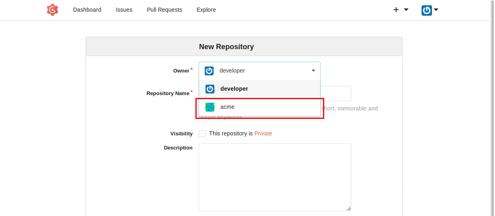
* Enter `driver-service` as repository name. Leave the other fields as is.
* Click `Create Repository`
* On the landing page of the newly created repository, copy the HTTP URL to the repository.
+
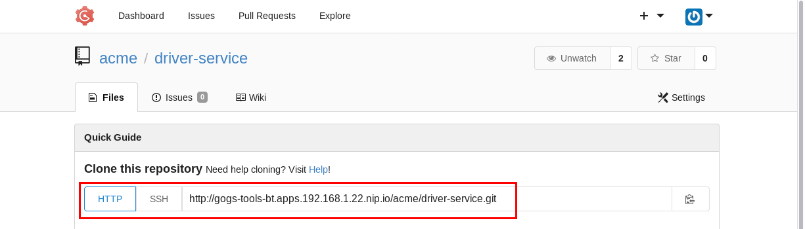
. Push the driver service source code to Gogs
* In a terminal window on your workstation, change directory to the directory where you cloned the driver service source code from GitHub.
* Add a new remote repository called `gogs` pointing to the repository on Gogs. Add the credentials for the developer user to the url of the remote. Push the source code.
+
----
$ git remote add gogs http://developer:developer123@<url of the driver service repository on gogs>
$ git checkout master
$ git push -u gogs master
----
. Repeat for the passenger service and the driver service source code.

==== Driver service installation

. Make sure you are logged with the `oc` client into your OpenShift environment.
. Create a project on OpenShift to deploy the services. The project name has to be unique within the OpenShift cluster, so use `services-` suffixed with your name or another unique identifier.
+
----
$ export $SERVICES_PRJ=services-<unique suffix>
$ oc new-project $SERVICES_PRJ
----
. Give the default service account in the project cluster view privileges. This is required because the services use the Kubernetes API to load their configuration configmap.
+
----
$ oc adm policy add-role-to-user view system:serviceaccount:$SERVICES_PRJ:default -n $SERVICES_PRJ
----
. Create a configmap with the configuration for the driver service.
* In a terminal window, change directory to the folder where you cloned the `driver-service` project of the lab material. Change directory to the `etc` folder inside the project.
* Open the `application-config.yaml` file in a text editor and review its content.
+
----
amqp.host:
amqp.port: 5671
amqp.user: user
amqp.password: password

amqp.replyhandling: false
amqp.ssl: true
amqp.ssl.trustall: false
amqp.ssl.verifyhost: true
amqp.truststore.path: /app/truststore/enmasse.jks
amqp.truststore.password: password

amqp.consumer.driver-command: topic-driver-command
amqp.producer.driver-event: topic-driver-event
amqp.producer.ride-event: topic-ride-event

http.port: 8080

# delay before sending a `DriverAssignedEvent` message
driver.assigned.min.delay: 1
driver.assigned.max.delay: 3
# delay before sending a `RideStartedEvent` message
ride.started.min.delay: 5
ride.started.max.delay: 10
# delay before sending a `RideEndedEvent` message
ride.ended.min.delay: 5
ride.ended.max.delay: 10
----
+
** amqp_port: 5671, which corresponds to the amqps protocol
** amqp_ssl: ssl is used, server certificate is checked and the hostname on the certificate must match
** amqp.replyhandling: Defines whether the Vert.x amqp bridge should try to enable support for sending messages with a reply handler set, and replying to messages using the message reply methods. Request/reply style messaging is not used in this lab, so this setting can be set to false.
* Set the `amqp.host` property to the hostname of the EnMasse `messaging` service. +
The hostname is `messaging.<enmasse project>.svc.cluster.local`, where `<enmasse project>` is the name of the OpenShift project where you installed EnMasse. +
Save the file.
* Create a configmap from the `application-config.yaml` file:
+
----
$ oc create configmap driver-service --from-file=application-config.yaml -n $SERVICES_PRJ
----
. Create a truststore holding the EnMasse messaging certificate.
* Extract the EnMasse messaging certificate from the `external-certs-messaging` secret in the EnMasse project"
+
----
$ oc get secret external-certs-messaging -o jsonpath='{.data.tls\.crt}' -n $ENMASSE_PRJ | base64 -d > messaging-cert.pem
----
+
Verify the contents of the `messaging-cert.pem` file.
+
----
$ cat messaging.pem
----
+
.Sample output
----
-----BEGIN CERTIFICATE-----
MIIDYTCCAkmgAwIBAgIJALwxhMIr5Z/NMA0GCSqGSIb3DQEBCwUAMEcxEzARBgNV
BAoMCmlvLmVubWFzc2UxMDAuBgNVBAMMJ21lc3NhZ2luZy5lbm1hc3NlLWJ0Mi5z
dmMuY2x1c3Rlci5sb2NhbDAeFw0xODA4MjIxOTEzNTdaFw00ODEwMDMxOTEzNTda
MEcxEzARBgNVBAoMCmlvLmVubWFzc2UxMDAuBgNVBAMMJ21lc3NhZ2luZy5lbm1h
c3NlLWJ0Mi5zdmMuY2x1c3Rlci5sb2NhbDCCASIwDQYJKoZIhvcNAQEBBQADggEP
ADCCAQoCggEBAMaoTtD0jUrAA7hxXE6kfBlaZ7OOi5HvZnFLDhoUHNGDWkrVzV5l
VJCpNFLpOir4ILDBfzs8pEQu/vAplmCGPx7MiuhvSWU1YxhZxLuM1Xk9KtUNyawf
1MGvgIH7wXxAVkSxPmdsmiFfbv0dx1JIHyqOCrtc0KbN+NQcu3Mg+clqjvbG8Lk4
ndDQVZCk8Ao19ZFk9H64r6WN3mUQD2tDbRWd+Mm8rkPvAT4PwDfgBrutJesiYQms
ayM4B2zMApquSx4RWSbt5y9iZ6KQOrb55YyTVW9SgQVhaG92J6vQkwDqlipTsCy3
2LvkbYmzb57iOmzzFzmonHLuZ2CKnDBNcjUCAwEAAaNQME4wHQYDVR0OBBYEFEkN
8bpQNU35ZCo6RrYV04A1hYnNMB8GA1UdIwQYMBaAFEkN8bpQNU35ZCo6RrYV04A1
hYnNMAwGA1UdEwQFMAMBAf8wDQYJKoZIhvcNAQELBQADggEBAJKGr6z7PP4jFj3Y
wa4T0jB2Es/WcXwkrP2BcsYNF8qoPSPPxbqdhvdow0IKVAfMHrIAAVFnaB06J+xq
MXl2fBd2LV7AujPNIZ3sDL10XglkW0Rtc7cCUFdTc/s+Oca8PrAk8T+eeMzIFeCU
lZJfpLxF2Le5t/fPy1V4kCMErb5Fm0pl7jO+cMvEXmD8US265A9gKKPuHOeJRm6G
27ftiIiOBP3ff0RdGtgeWNcaWEz6R+WnrndFCrQrSc+RQddXIZ7KsiCMQCMKRmOq
pmODbLOVK6tHiQalR3uN2xeo7HBu9mOpExTyLMF78y2KoIUTVcOrhZwyaZFM6+V9
BXi+Rfk=
-----END CERTIFICATE-----
----
* Alternatively, you can download the EnMasse messaging certificate from the EnMasse console. Open the EnMasse console in a browser window. On the bottom of the dashboard pane you'll find a link to download the certificate.
+
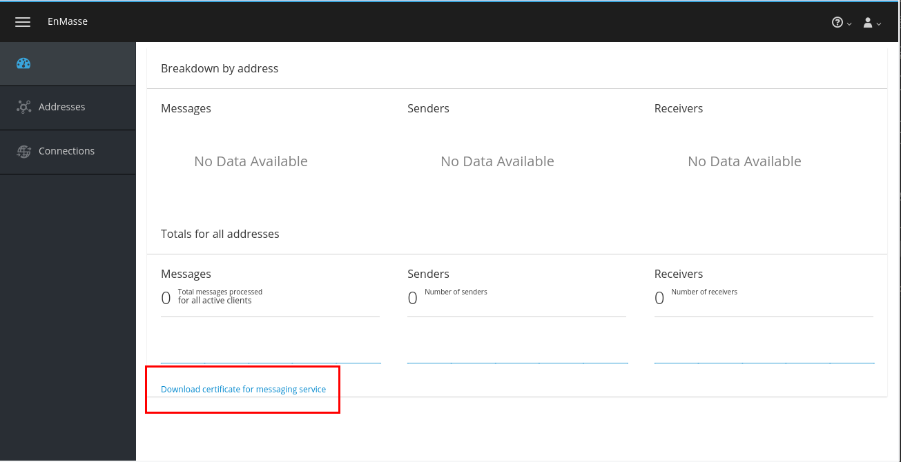
* Create a JKS truststore containing the EnMasse certificate with the `keytool` tool. The truststore password is `password`.
+
----
$ keytool -importcert -trustcacerts -file messaging-cert.pem -keystore enmasse.jks -storepass password -noprompt
----
. Create a secret with the truststore.
+
----
$ oc create secret generic enmasse-truststore --from-file=enmasse.jks -n $SERVICES_PRJ
----
. In a terminal, change directory to the folder where you cloned the `installation` project of the lab material.
. Review the Openshift templates for the driver service in the `openshift/driver-service` directory:
* *driver-service-template.yaml*: defines the service and the deployment config for the driver service.
** The secret with the truststore is mounted in the `app/truststore` directory in the container.
** There is no need to mount the configmap, as the application uses the Kubernetes API to load the configmap directly.
* *driver-service-binary.yaml*: defines the buildconfig used by the build pipeline to build the image for the service, and the corresponding imagestream.
* *driver-service-pipeline.yml*: the build pipeline for the driver service. The Jenkins file is embedded in the pipeline.
. Deploy the templates to OpenShift. Note that the buildconfig and the build pipeline are created in the OpenShift project were Jenkins is deployed.
+
----
$ oc process -f openshift/driver-service/driver-service-template.yaml -p APPLICATION_NAME=driver-service -p APPLICATION_CONFIGMAP=driver-service -p APPLICATION_TRUSTSTORE=enmasse-truststore | oc create -f - -n $SERVICES_PRJ
$ oc process -f openshift/driver-service/driver-service-binary.yaml -p APPLICATION_NAME=driver-service -p IMAGE_STREAM=redhat-openjdk18-openshift:1.4 | oc create -f - -n $TOOLS_PRJ
$ oc process -f openshift/driver-service/driver-service-pipeline.yaml -p BC_NAME=driver-service-pipeline -p GIT_URL=http://gogs:3000 -p GIT_REPO=acme/driver-service.git -p APP_BUILD=driver-service-binary -p APP_PROJECT=$SERVICES_PRJ -p JENKINS_PROJECT=$TOOLS_PRJ -p APP_IMAGESTREAM=driver-service -p APP_DC=driver-service | oc create -f - -n $TOOLS_PRJ
----
. Give the Jenkins service account project admin rights in the services project:
+
----
$ oc adm policy add-role-to-user edit system:serviceaccount:$TOOLS_PRJ:jenkins -n $SERVICES_PRJ
----
. Start the pipeline for the driver service:
+
----
$ oc start-build driver-service-pipeline -n $TOOLS_PRJ
----
. Follow the progression of the build pipeline in the OpenShift console. Expect the pipeline to complete succesfully.
+

+
If the pipeline build fails, check the pipeline build logs to see what went wrong, and if needed fix the issue.
. Once the pipeline has executed, check that the driver service has deployed successfully.
+
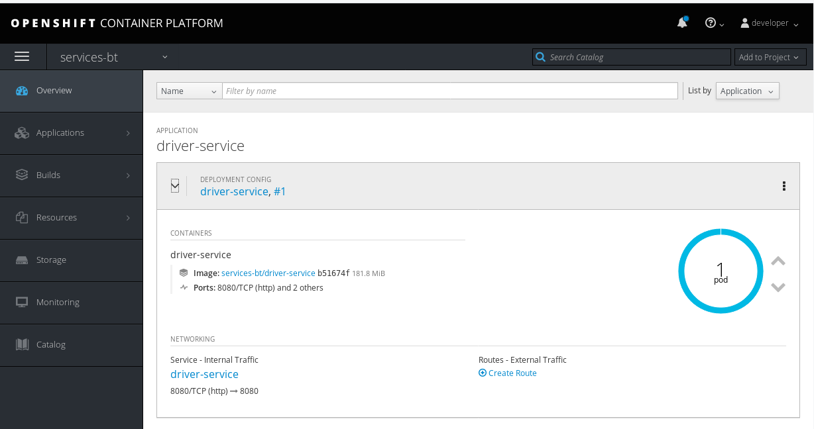
. In the OpenShift console, navigate to the driver service pod, and check the logs of the pod. Alternatively you can use `oc logs -f <name of the pod>`. +
Expect to see something like:
+
----
Starting the Java application using /opt/run-java/run-java.sh ...
exec java -Dapplication.configmap=driver-service -Dvertx.logger-delegate-factory-class-name=io.vertx.core.logging.SLF4JLogDelegateFactory -Xms63m -Xmx250m -XX:+UnlockExperimentalVMOptions -XX:+UseCGroupMemoryLimitForHeap -XX:+UseParallelOldGC -XX:MinHeapFreeRatio=10 -XX:MaxHeapFreeRatio=20 -XX:GCTimeRatio=4 -XX:AdaptiveSizePolicyWeight=90 -XX:MaxMetaspaceSize=100m -XX:ParallelGCThreads=1 -Djava.util.concurrent.ForkJoinPool.common.parallelism=1 -XX:CICompilerCount=2 -XX:+ExitOnOutOfMemoryError -cp . -jar /deployments/driver-service-simulator-1.0-SNAPSHOT.jar
2018-08-25 12:57:36.883  INFO   --- [ntloop-thread-3] MessageProducer                          : AMQP bridge to messaging.enmasse-bt.svc.cluster.local:5671 started
2018-08-25 12:57:36.883  INFO   --- [ntloop-thread-2] MessageConsumer                          : AMQP bridge to messaging.enmasse-bt.svc.cluster.local:5671 started
2018-08-25 12:57:36.893  INFO   --- [ntloop-thread-0] c.a.r.d.service.simulator.MainVerticle   : Verticles deployed successfully.
2018-08-25 12:57:36.894  INFO   --- [ntloop-thread-4] i.v.c.i.l.c.VertxIsolatedDeployer        : Succeeded in deploying verticle
----

==== Passenger service installation

The procedure is equivalent to the driver service.

. Create a configmap with the configuration for the passenger service.
* In a terminal window, change directory to the folder where you cloned the `passenger-service` project of the lab material. Change directory to the `etc` folder inside the project.
* Open the `application.properties` file in a text editor and review its content.
+
----
amqp.host=
amqp.port=5671
amqp.query=transport.trustAll=false&transport.verifyHost=true
amqphub.amqp10jms.remote-url=amqps://${amqp.host}:${amqp.port}?${amqp.query}
amqphub.amqp10jms.username=user
amqphub.amqp10jms.password=password
amqphub.amqp10jms.pool.enabled=true
amqphub.amqp10jms.pool.explicit-producer-cache-size=10
amqphub.amqp10jms.pool.use-anonymous-producers=false

spring.jms.pub-sub-domain=True
spring.jms.session-cache-size=10
spring.jms.transacted=True
spring.jms.subscription-shared=True
spring.jms.subscription-durable=True

spring.jms.listener.concurrency=20
spring.jms.listener.max-concurrency=20

sender.destination.ride-requested=topic-ride-event
sender.destination.passenger-canceled=topic-passenger-event

listener.destination.driver-assigned=topic-driver-event
listener.subscription.driver-assigned=passenger-service

logging.level.com.acme.ride=DEBUG
----
+
** amqp.port: 5671, which corresponds to the amqps protocol
** amqp.query: server certificate is checked and the hostname on the certificate must match
** amqphub.amqp10jms.pool.use-anonymous-producers: message producers are created and cached per destination

* Set the `amqp.host` property to the hostname of the EnMasse `messaging` service. +
Save the file.
* Create a configmap from the `application.properties` file:
+
----
$ oc create configmap passenger-service --from-file=application.properties -n $SERVICES_PRJ
----
** Note that the name of the configmap corresponds to the `spring.application.name` value in the `src/main/resources/application.properties` properties file. The _spring_kubernetes_config_ module uses the name specified in `spring.application.name` to load the configmap and apply the properties.

. In a terminal, change directory to the folder where you cloned the `installation` project of the lab material.
. Review the Openshift templates for the passenger service in the `openshift/passenger-service` directory:
* *passenger-service-template.yaml*: defines the route, service service and the deployment config for the passenger service.
** The secret with the truststore is mounted in the `app/truststore` directory in the container.
** There is no need to mount the configmap, as the application uses the Kubernetes API to load the configmap directly.
* *passenger-service-binary.yaml*: defines the buildconfig used by the build pipeline to build the image for the service, and the corresponding imagestream.
* *passenger-service-pipeline.yml*: the build pipeline for the passenger service. The Jenkins file is embedded in the pipeline.
. Deploy the templates to OpenShift. Note that the buildconfig and the build pipeline are created in the OpenShift project were Jenkins is deployed.
+
----
$ oc process -f openshift/passenger-service/passenger-service-template.yaml -p APPLICATION_NAME=passenger-service -p APPLICATION_CONFIGMAP=passenger-service -p APPLICATION_TRUSTSTORE=enmasse-truststore | oc create -f - -n $SERVICES_PRJ
$ oc process -f openshift/passenger-service/passenger-service-binary.yaml -p APPLICATION_NAME=passenger-service -p IMAGE_STREAM=redhat-openjdk18-openshift:1.4 | oc create -f - -n $TOOLS_PRJ
$ oc process -f openshift/passenger-service/passenger-service-pipeline.yaml -p BC_NAME=passenger-service-pipeline -p GIT_URL=http://gogs:3000 -p GIT_REPO=acme/passenger-service.git -p APP_BUILD=passenger-service-binary -p APP_PROJECT=$SERVICES_PRJ -p JENKINS_PROJECT=$TOOLS_PRJ -p APP_IMAGESTREAM=passenger-service -p APP_DC=passenger-service | oc create -f - -n $TOOLS_PRJ
----
. Start the pipeline for the passenger service:
+
----
$ oc start-build passenger-service-pipeline -n $TOOLS_PRJ
----
. Follow the progression of the build pipeline in the OpenShift console. Expect the pipeline to complete successfully. +
If the pipeline build fails, check the pipeline build logs to see what went wrong, and if needed fix the issue.
. Once the pipeline has executed, check that the passenger service has deployed successfully.
+
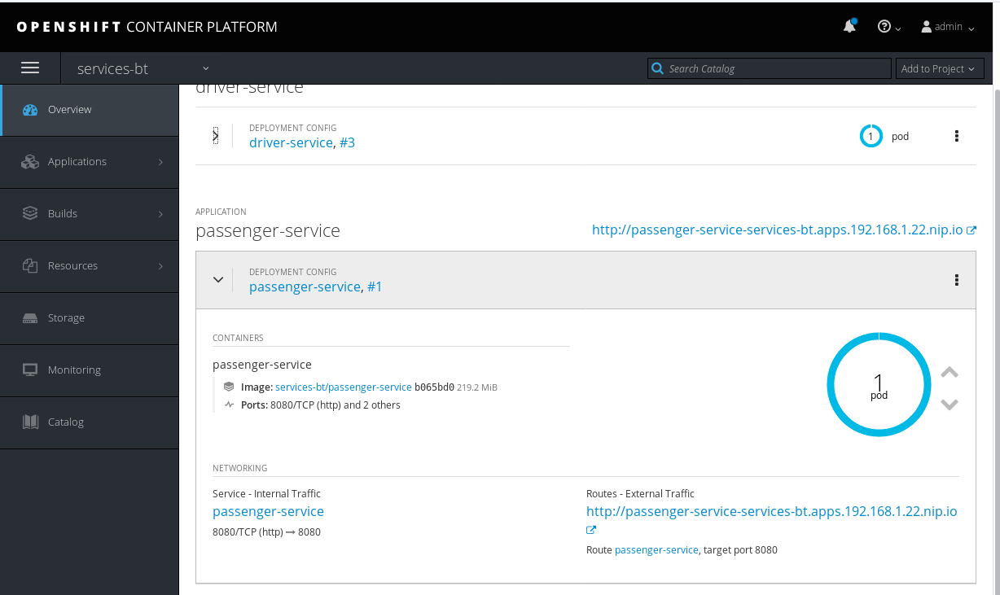
. In the OpenShift console, navigate to the passenger service pod, and check the logs of the pod. Alternatively you can use `oc logs -f <name of the pod>`. +
The last lines of the log look like:
+
----
2018-08-26 13:16:17.341  INFO 1 --- [           main] o.s.j.e.a.AnnotationMBeanExporter        : Located managed bean 'restartEndpoint': registering with JMX server as MBean [org.springframework.cloud.context.restart:name=restartEndpoint,type=RestartEndpoint]
2018-08-26 13:16:17.346  INFO 1 --- [           main] o.s.j.e.a.AnnotationMBeanExporter        : Located managed bean 'refreshScope': registering with JMX server as MBean [org.springframework.cloud.context.scope.refresh:name=refreshScope,type=RefreshScope]
2018-08-26 13:16:17.355  INFO 1 --- [           main] o.s.j.e.a.AnnotationMBeanExporter        : Located managed bean 'configurationPropertiesRebinder': registering with JMX server as MBean [org.springframework.cloud.context.properties:name=configurationPropertiesRebinder,context=56a6d5a6,type=ConfigurationPropertiesRebinder]
2018-08-26 13:16:17.437  INFO 1 --- [           main] o.s.j.e.a.AnnotationMBeanExporter        : Located managed bean 'refreshEndpoint': registering with JMX server as MBean [org.springframework.cloud.endpoint:name=refreshEndpoint,type=RefreshEndpoint]
2018-08-26 13:16:17.740  INFO 1 --- [           main] o.s.c.support.DefaultLifecycleProcessor  : Starting beans in phase 0
2018-08-26 13:16:17.839  INFO 1 --- [           main] o.s.c.support.DefaultLifecycleProcessor  : Starting beans in phase 2147483647
2018-08-26 13:16:18.846  INFO 1 --- [ter.local:5671]] o.a.qpid.jms.sasl.SaslMechanismFinder    : Best match for SASL auth was: SASL-PLAIN
2018-08-26 13:16:19.117  INFO 1 --- [ter.local:5671]] org.apache.qpid.jms.JmsConnection        : Connection ID:2ee56c66-b121-4385-9bbb-8ed678f8da0b:1 connected to remote Broker: amqps://messaging.enmasse-bt.svc.cluster.local:5671?transport.trustAll=false&transport.verifyHost=true
2018-08-26 13:16:19.149  INFO 1 --- [           main] s.b.c.e.t.TomcatEmbeddedServletContainer : Tomcat started on port(s): 8080 (http)
2018-08-26 13:16:19.152  INFO 1 --- [           main] c.a.r.p.PassengerServiceApplication      : Started PassengerServiceApplication in 15.507 seconds (JVM running for 17.565)
----

==== Dispatch service installation

The main difference between the dispatch service and the other services is the use of a database for the embedded process engine. We use PostgreSQL as database, and create the schema for the process engine and the application domain model using an init container.

. Create a configmap for the database initialization scripts.
* In a terminal, change directory to the folder where you cloned the `installation` project of the lab material.
* Review the scripts in the `openshift/dispatch-service-postgresql/postgresql` directory. These scripts will execute in the init container.
** wait_for_postgresql.sh: script that loops until the PostgreSQL database is up.
** create_rhpam_database.sh: executes the sql ddl scripts.
** postgresql-jbpm-schema.sql, postgresql-jbpm-schema.sql, quartz_tables_postgres.sql: sql ddl scripts to create the schema for the embedded process engine, including the tables for the quartz scheduler.
** ride-schema.sql: sql ddl script for the `Ride` entity.
* Create a configmap with the scripts:
+
----
$ oc create configmap dispatch-service-postgresql-init --from-file=openshift/dispatch-service/postgresql -n $SERVICES_PRJ
----
. Review the `openshift/dispatch-service-postgresql/postgresql-persistent-template.yaml` template. Notice the use of the init-container in the `spec.strategy.recreateParams.execNewPod` section of the deployment config.
. Deploy PostgreSQL using the template:
+
----
$ oc new-app -f openshift/dispatch-service/postgresql-persistent-template.yaml --param=APPLICATION_NAME=dispatch-service --param=DATABASE_SERVICE_NAME=dispatch-service-postgresql --param=POSTGRESQL_USER=jboss --param=POSTGRESQL_PASSWORD=jboss --param=POSTGRESQL_DATABASE=rhpam --param=POSTGRESQL_MAX_CONNECTIONS=100 --param=POSTGRESQL_MAX_PREPARED_TRANSACTIONS=100 -n $SERVICES_PRJ
----
. When the PostgreSQL pod is up and running, verify that the database schema has been creaed correctly.
* In a browser window, navigate to the URL of the pgAdmin4 route. Log in with `admin@example.com/admin123`
* Click on the `Add new Server` link on the landing page.
* In the `Create Server` dialog box, enter `rhpam` as Server name.
* In the `Connections` tab, enter the following values:
** Hostname: the url of the PostgreSQL service. This is `dispatch-service-postgresql.<name of the services project>.svc`.
** Port: leave to 5432
** username: jboss
** password: jboss
* Click on `Save`.
* Click on the `+` icon next to the `rhpam` node in the `Browser` pane.
+
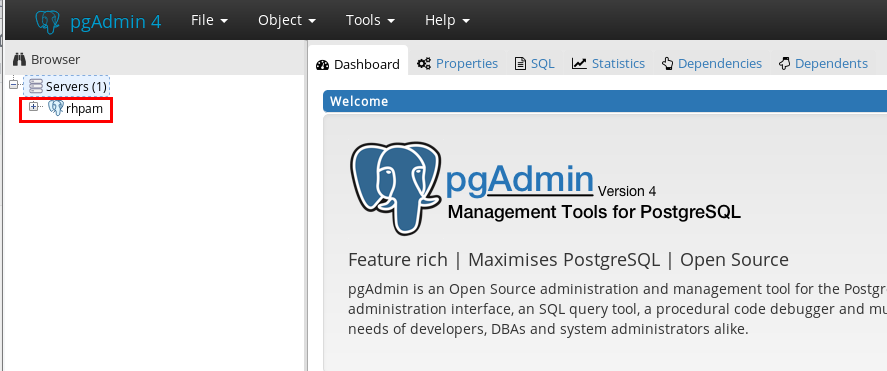
* Further expand the tree to the `databases/rhpam/Schemas/public/Tables` node.
+
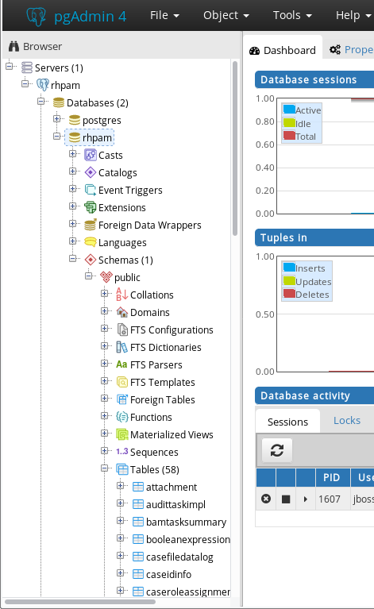
* Expect to see the tables of the RHPAM schema. Verify that the list also contains a table `Ride`.

. Create a configmap with the configuration for the dispatch service.
* In a terminal window, change directory to the folder where you cloned the `dispatch-service` project of the lab material. Change directory to the `etc` folder inside the project.
* Open the `application.properties` file in a text editor and review its content.
+
----
postgresql.host=
amqp.host=

spring.datasource.username=jboss
spring.datasource.password=jboss
spring.datasource.url=jdbc:postgresql://${postgresql.host}:5432/rhpam

narayana.dbcp.max-total=20

amqp.port=5671
amqp.query=transport.trustAll=false&transport.verifyHost=true
amqphub.amqp10jms.remote-url=amqps://${amqp.host}:${amqp.port}?${amqp.query}
amqphub.amqp10jms.username=user
amqphub.amqp10jms.password=password
amqphub.amqp10jms.pool.enabled=true
amqphub.amqp10jms.pool.explicit-producer-cache-size=10
amqphub.amqp10jms.pool.use-anonymous-producers=false

spring.jms.pub-sub-domain=True
spring.jms.transacted=True
spring.jms.subscription-shared=True
spring.jms.subscription-durable=True

spring.jms.listener.concurrency=20
spring.jms.listener.max-concurrency=20

listener.destination.ride-event=topic-ride-event
listener.subscription.ride-event=dispatch-ride

listener.destination.driver-assigned-event=topic-driver-event
listener.subscription.driver-assigned-event=dispatch-driver

listener.destination.passenger-canceled-event=topic-passenger-event
listener.subscription.passenger-canceled-event=dispatch-passenger

send.destination.assign_driver_command=topic-driver-command

send.destination.handle_payment_command=topic-passenger-command

dispatch.assign.driver.expire.duration=5M

logging.level.org.jbpm.executor.impl=WARN
logging.level.com.acme.ride=DEBUG
----
* narayana.dbcp.max-total: maximum number of connections in the datasource connection pool managed by the Naryana transaction manager.
* Set the `amqp.host` property to the hostname of the EnMasse `messaging` service.
* Set the `postgresql.host` property to the hostname of the PostgreSQL service. +
As the PostgreSQL database is deployed in the same OpenShift project as the application, you can use the service name: `dispatch-service-postgresql`.
* Save the file.
* Create a configmap from the `application.properties` and the `jbpm-quartz.properties` file:
+
----
$ oc create configmap dispatch-service --from-file=application.properties --from-file=jbpm-quartz.properties -n $SERVICES_PRJ
----
** Note that the name of the configmap corresponds to the `spring.application.name` value in the `src/main/resources/application.properties` properties file. The _spring_kubernetes_config_ module uses the name specified in `spring.application.name` to load the configmap and apply the properties.
** The `jbpm-quartz.properties` is the configuration file for the Quartz scheduler. The scheduler is set up for clustered use, ensuring that only 1 node in the cluster can fire a job.
. In a terminal, change directory to the folder where you cloned the `installation` project of the lab material.
. Review the Openshift templates for the dispatch service in the `openshift/dispatch-service` directory:
* *dispatch-service-template.yaml*: defines the route, service and the deploymentconfig for the dispatch service.
** The secret with the truststore is mounted in the `app/truststore` directory in the container.
** The configmap is mounted in the `/app/config` directory. The dispatch service is started with the Java system property `org.quartz.properties` pointing to the `jbpm-quartz.properties` properties file.
* *dispatch-service-binary.yaml*: defines the buildconfig used by the build pipeline to build the image for the service, and the corresponding imagestream.
* *dispatch-service-pipeline.yml*: the build pipeline for the dispatch service. The Jenkins file is embedded in the pipeline.
. Deploy the templates to OpenShift. Note that the buildconfig and the build pipeline are created in the OpenShift project were Jenkins is deployed.
+
----
$ oc process -f openshift/dispatch-service/dispatch-service-template.yaml -p APPLICATION_NAME=dispatch-service -p APPLICATION_CONFIGMAP=dispatch-service -p APPLICATION_TRUSTSTORE=enmasse-truststore | oc create -f - -n $SERVICES_PRJ
$ oc process -f openshift/dispatch-service/dispatch-service-binary.yaml -p APPLICATION_NAME=dispatch-service -p IMAGE_STREAM=redhat-openjdk18-openshift:1.4 | oc create -f - -n $TOOLS_PRJ
$ oc process -f openshift/dispatch-service/dispatch-service-pipeline.yaml -p BC_NAME=dispatch-service-pipeline -p GIT_URL=http://gogs:3000 -p GIT_REPO=acme/dispatch-service.git -p APP_BUILD=dispatch-service-binary -p APP_PROJECT=$SERVICES_PRJ -p JENKINS_PROJECT=$TOOLS_PRJ -p APP_IMAGESTREAM=dispatch-service -p APP_DC=dispatch-service | oc create -f - -n $TOOLS_PRJ
----
. Start the pipeline for the dispatch service:
+
----
$ oc start-build dispatch-service-pipeline -n $TOOLS_PRJ
----
. Follow the progression of the build pipeline in the OpenShift console. Expect the pipeline to complete successfully. +
If the pipeline build fails, check the pipeline build logs to see what went wrong, and if needed fix the issue.
. Once the pipeline has executed, check that the dipatch service has deployed successfully.
+
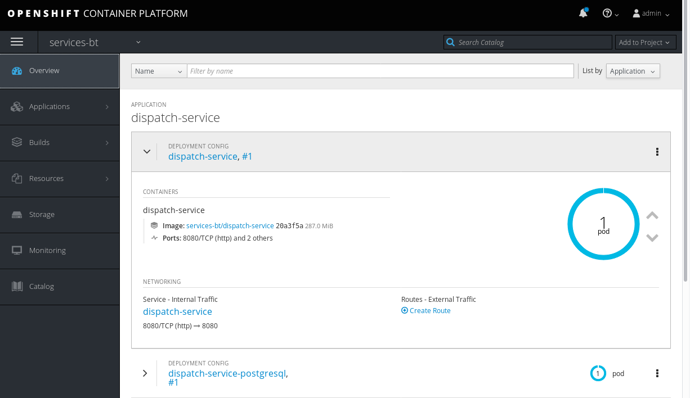
. In the OpenShift console, navigate to the dispatch service pod, and check the logs of the pod. Alternatively you can use `oc logs -f <name of the pod>`. +
The last lines of the log look like:
+
----
2018-08-27 07:25:25.749  INFO 1 --- [           main] o.s.c.support.DefaultLifecycleProcessor  : Starting beans in phase 0
2018-08-27 07:25:25.847  INFO 1 --- [           main] o.s.c.support.DefaultLifecycleProcessor  : Starting beans in phase 2147483647
2018-08-27 07:25:27.437  INFO 1 --- [ter.local:5671]] o.a.qpid.jms.sasl.SaslMechanismFinder    : Best match for SASL auth was: SASL-PLAIN
2018-08-27 07:25:27.582  INFO 1 --- [           main] o.s.j.c.SingleConnectionFactory          : Established shared JMS Connection: org.apache.qpid.jms.JmsConnection@794cb26b
2018-08-27 07:25:27.726  INFO 1 --- [ter.local:5671]] org.apache.qpid.jms.JmsConnection        : Connection ID:d8802bd8-94e7-4e58-b8a7-f53fe8e38dfa:1 connected to remote Broker: amqps://messaging.enmasse-bt.svc.cluster.local:5671?transport.trustAll=false&transport.verifyHost=true
2018-08-27 07:25:27.853  INFO 1 --- [           main] s.b.c.e.t.TomcatEmbeddedServletContainer : Tomcat started on port(s): 8080 (http)
2018-08-27 07:25:27.855  INFO 1 --- [           main] c.a.r.d.DispatchServiceApplication       : Started DispatchServiceApplication in 37.214 seconds (JVM running for 39.257)
2018-08-27 07:25:37.066  INFO 1 --- [nio-8080-exec-1] o.a.c.c.C.[Tomcat].[localhost].[/]       : Initializing Spring FrameworkServlet 'dispatcherServlet'
2018-08-27 07:25:37.066  INFO 1 --- [nio-8080-exec-1] o.s.web.servlet.DispatcherServlet        : FrameworkServlet 'dispatcherServlet': initialization started
2018-08-27 07:25:37.145  INFO 1 --- [nio-8080-exec-1] o.s.web.servlet.DispatcherServlet        : FrameworkServlet 'dispatcherServlet': initialization completed in 79 ms
2018-08-27 07:25:37.251  INFO 1 --- [ter.local:5671]] o.a.qpid.jms.sasl.SaslMechanismFinder    : Best match for SASL auth was: SASL-PLAIN
2018-08-27 07:25:37.374  INFO 1 --- [nio-8080-exec-1] o.s.j.c.CachingConnectionFactory         : Established shared JMS Connection: org.apache.qpid.jms.JmsConnection@7de77b53
2018-08-27 07:25:37.498  INFO 1 --- [ter.local:5671]] org.apache.qpid.jms.JmsConnection        : Connection ID:359839ad-9547-4a08-9354-03be0a297667:1 connected to remote Broker: amqps://messaging.enmasse-bt.svc.cluster.local:5671?transport.trustAll=false&transport.verifyHost=true
----

==== Application services Ansible installation

If you have Ansible installed, you can run the Ansible playbooks provided in the lab material to provision the application services. The playbooks execute the same steps as the manual install. The only thing that remains to be done is to kick off the build pipelines.

. Make sure you are logged with the `oc` client into your OpenShift environment.
. In a terminal, change directory to the folder where you cloned the `installation` project of the lab material. Change directory to the `ansible` folder.
. Run the service playbooks.
+
----
$ cd ansible
$ ansible-playbook playbooks/driver_service.yml -e project_enmasse=$ENMASSE_PRJ -e project_tools=$TOOLS_PRJ -e project_services=$SERVICES_PRJ
$ ansible-playbook playbooks/passenger_service.yml -e project_enmasse=$ENMASSE_PRJ -e project_tools=$TOOLS_PRJ -e project_services=$SERVICES_PRJ
$ ansible-playbook playbooks/dispatch_service.yml -e project_enmasse=$ENMASSE_PRJ -e project_tools=$TOOLS_PRJ -e project_services=$SERVICES_PRJ
----
. Expect the playbook to run to completion without failures.
. Start the pipeline for the different services:
+
----
$ oc start-build driver-service-pipeline -n $TOOLS_PRJ
$ oc start-build passenger-service-pipeline -n $TOOLS_PRJ
$ oc start-build dispatch-service-pipeline -n $TOOLS_PRJ
----

== Running the application

With all the components of the application up and running, it is time to test things out.

The passenger service exposes a REST endpoint, which when called will send 1 or more `RideRequestedEvent` messages to the `topic-ride-event` topic.

. In a terminal window, execute the following command using curl:
+
----
$ PASSENGER_SERVICE_URL=$(echo "http://$(oc get route passenger-service -o jsonpath='{.spec.host}' -n $SERVICES_PRJ)")
$ curl -X POST -H "Content-type: application/json" -d '{"messages": 1, "type": 1}' $PASSENGER_SERVICE_URL/simulate
----
.Output
+
----
Sent 1 message(s) with type 1
----
* The type of the message determines the message flow. A type 1 message follows the 'happy path': ride requested -> driver assigned -> ride started -> ride ended -> payment handled.
. Check the log of the dispatch service in the OpenShift console or using `oc logs`. Expect to see the following, after a couple of seconds:
+
----
2018-08-27 10:40:08.863 DEBUG 1 --- [enerContainer-6] c.a.r.d.m.l.RideEventsMessageListener    : Processing 'RideRequestedEvent' message for ride 2ad3c3fe-9228-4060-a916-4c4b6655e004
2018-08-27 10:40:09.522 DEBUG 1 --- [enerContainer-6] c.a.r.d.m.l.RideEventsMessageListener    : Started dispatch process for ride request 2ad3c3fe-9228-4060-a916-4c4b6655e004. ProcessInstanceId = 1
2018-08-27 10:40:11.793 DEBUG 1 --- [enerContainer-9] d.m.l.DriverAssignedEventMessageListener : Processing 'DriverAssignedEvent' message for ride 2ad3c3fe-9228-4060-a916-4c4b6655e004
2018-08-27 10:40:17.794 DEBUG 1 --- [enerContainer-1] c.a.r.d.m.l.RideEventsMessageListener    : Processing 'RideStartedEvent' message for ride 2ad3c3fe-9228-4060-a916-4c4b6655e004
2018-08-27 10:40:25.677 DEBUG 1 --- [nerContainer-10] c.a.r.d.m.l.RideEventsMessageListener    : Processing 'RideEndedEvent' message for ride 2ad3c3fe-9228-4060-a916-4c4b6655e004
----
. Check the log of the driver service:
+
----
2018-08-27 10:40:09.653 DEBUG   --- [ntloop-thread-2] MessageConsumer                          : Consumed 'AssignedDriverCommand' message for ride 2ad3c3fe-9228-4060-a916-4c4b6655e004
2018-08-27 10:40:11.664 DEBUG   --- [ntloop-thread-3] MessageProducer                          : Sent 'DriverAssignedMessage' for ride 2ad3c3fe-9228-4060-a916-4c4b6655e004
2018-08-27 10:40:17.669 DEBUG   --- [ntloop-thread-3] MessageProducer                          : Sent 'RideStartedMessage' for ride 2ad3c3fe-9228-4060-a916-4c4b6655e004
2018-08-27 10:40:25.676 DEBUG   --- [ntloop-thread-3] MessageProducer                          : Sent 'RideEndedMessage' for ride 2ad3c3fe-9228-4060-a916-4c4b6655e004
----
. Check the log of the passenger service:
+
----
2018-08-27 10:40:08.788  INFO 1 --- [nio-8080-exec-7] c.a.r.p.m.RideRequestedMessageSender     : Sent 'RideRequestedEvent' for ride 2ad3c3fe-9228-4060-a916-4c4b6655e004
2018-08-27 10:40:11.839 DEBUG 1 --- [enerContainer-1] r.p.m.DriverAssignedEventMessageListener : Consumed 'DriverAssignedEvent' for ride 2ad3c3fe-9228-4060-a916-4c4b6655e004
----
. Check the state of the database:
* In a browser window, navigate to the URL of the pgAdmin4 route, and log in if required. Expand the browser tree in the left pane until you see the `Ride` table in the rhpam database.
* Right-click on the `Ride` table and select `Scripts -> SELECT script`.
+
image::images/pgadmin4_create_script.png[]
* In the script window that opens, click on the `lightning` icon to execute the query. Expect to see one row with the `ride` entity created by the dispatch service.
+
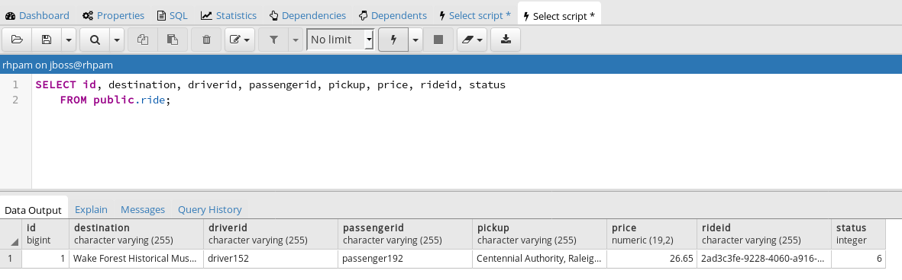
** The status of the ride is `6`, which corresponds to `ENDED`.
* Check the `ProcessInstanceLog` tabel. Expect to see one row, with the following values:
** processid: `acme-ride.dispatch-process`
** correlationkey: the value corresponds to the `rideId` of the `Ride` entity.
** status: 2, which corresponds to `COMPLETED`

. Check the EnMasse console.
* In a browser window, navigate to the URL of the EnMasse console. The dashboard shows some activity:
+
image::images/enmasse_console_dashboard.png[]
* Open the `Addresses` tab. Expect to see something like:
+
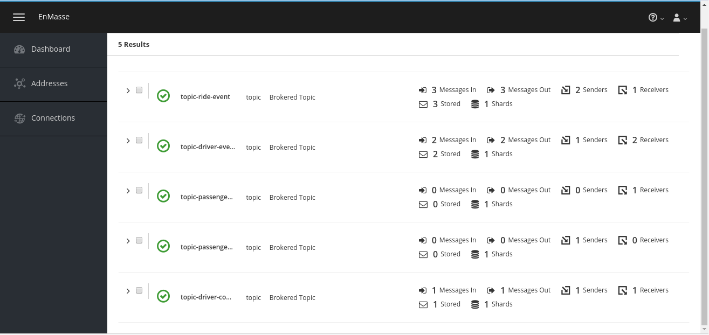
** Three messages were sent and consumed from to the `topic-ride-event` topic (which corresponds to one `RideRequestedEvent` message, one `RideStartedEvent` message and one `RideEndedEvent` message).
** Two messages were sent to and consumed from the `topic-driver-event` topic - this corresponds to the `DriverAssignedEvent` that was sent by the driver service and consumed by both the passenger service and the dispatch service.
** One message was sent to and consumed from the `topic-driver-command` topic - this corresponds to the `AssignDriverCommand` event sent by the dispatch service and consumed by the driver service.
** There is no consumer for the `topic-passenger-command` topic, so the `HandlePaymentCommand` sent in the last stepp of the dispatch service process does not show up in the console.
* Click on an address, to see some details about subscribers to that address.
** The `topic-driver-command` topic has one non-durable subscriber:
+
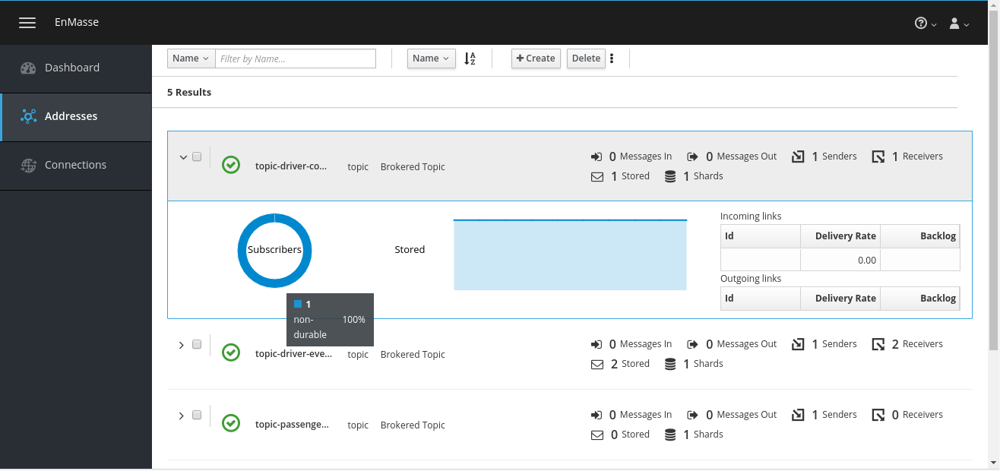
+
This matches the non-shared, non-durable consumer from the driver-service
** The `topic-driver-event` topic, has two durable subscribers:
+
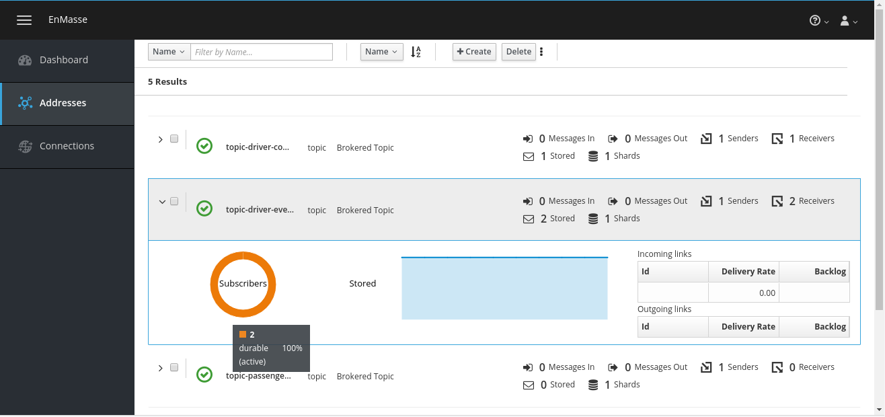
* The `Connections` tab shows the active browser connections:
+
image::images/enmasse_console_connections.png[]
* Expand a connection to see some details. For example, the connection that shows 3 messages in and two senders:
+
image::images/enmasse_console_connections_2.png[]
+
This connection represents the `ProducerVerticle` in the driver service.
* The connection that shows 1 message in, has 1 sender and 10 receivers:
+
image::images/enmasse_console_connections_3.png[]
+
This connection is from the passenger service. It shows 10 receivers because we use a pool of 10 message listeners.
* The other connections are from the `ConsumerVerticle` in the driver service and from the message listeners and producer in the dispatch service (3 times 20 listeners).

. Send a command to the REST API of the passenger service to send a `RideRequestedEvent` message of type 2.
+
----
$ curl -X POST -H "Content-type: application/json" -d '{"messages": 1, "type": 2}' $PASSENGER_SERVICE_URL/simulate
----
+
A type 2 message mimicks the scenario where the passenger cancels the ride: ride requested -> driver assigned -> passenger cancelled.
+
* Check the logs of the different service pods, the database and the EnMasse console.
** The `Ride` for this ride has status 4 (`PASSENGER_CANCELED`)
** The passenger service log shows that the passenger is canceling the ride:
+
----
2018-08-27 16:42:24.831  INFO 1 --- [nio-8080-exec-5] c.a.r.p.m.RideRequestedMessageSender     : Sent 'RideRequestedEvent' for ride 7f016ed9-ba81-425f-a989-b35afdf9dace
2018-08-27 16:42:27.175 DEBUG 1 --- [enerContainer-8] r.p.m.DriverAssignedEventMessageListener : Consumed 'DriverAssignedEvent' for ride 7f016ed9-ba81-425f-a989-b35afdf9dace
2018-08-27 16:42:27.175  INFO 1 --- [enerContainer-8] r.p.m.DriverAssignedEventMessageListener : Passenger is canceling ride 7f016ed9-ba81-425f-a989-b35afdf9dace
----
** The dispatcher server logs shows that the service consumed a `PassengerCancelledEvent` message.
+
----
2018-08-27 16:42:24.832 DEBUG 1 --- [enerContainer-7] c.a.r.d.m.l.RideEventsMessageListener    : Processing 'RideRequestedEvent' message for ride 7f016ed9-ba81-425f-a989-b35afdf9dace
2018-08-27 16:42:24.859 DEBUG 1 --- [enerContainer-7] c.a.r.d.m.l.RideEventsMessageListener    : Started dispatch process for ride request 7f016ed9-ba81-425f-a989-b35afdf9dace. ProcessInstanceId = 2
2018-08-27 16:42:27.175 DEBUG 1 --- [enerContainer-1] d.m.l.DriverAssignedEventMessageListener : Processing 'DriverAssignedEvent' message for ride 7f016ed9-ba81-425f-a989-b35afdf9dace
2018-08-27 16:42:28.315 DEBUG 1 --- [enerContainer-3] .l.PassengerCanceledEventMessageListener : Processing 'PassengerCancelled' message for ride 7f016ed9-ba81-425f-a989-b35afdf9dace
Passenger cancelled
----
* The EnMasse console shows a total of 11 messages (6 from the first test, 5 from this test).

. Finally, send a command to the REST API of the passenger service to send a `RideRequestedEvent` message of type 3.
+
----
$ curl -X POST -H "Content-type: application/json" -d '{"messages": 1, "type": 2}' $PASSENGER_SERVICE_URL/simulate
----
+
A type 3 message mimicks the scenario where no driver can be assigned to the ride: ride requested -> request expires. It will actually take 5 minutes before the ride expires.
+
* Check the logs of the different service pods, the database and the EnMasse console.
** The `Ride` for this ride has status 1 (`RIDE_REQUESTED`)
** The `ProcessInstanceLog` table shows thath the process instance has status 1 (`ACTIVE`)
** There is a row in the `ProcessInstanceInfo` for the active process instance.
** After 5 minutes, the status of the `Ride` entity moves to 7 (`EXPIRED`), and the process instance completes (status moves to 2 - `COMPLETED`)

* The EnMasse console shows a total of 13 messages (6 from the first test, 5 from the previous test and 2 for this test).

. Now you can put some load on the system. This can be done by sending a command to the REST API of the passenger service to send multiple `RideRequestedEvent` messages. If you chose type 0, you will have a mix of the different types, with approximately 6% messages of type 2 and 6% of type 3.
+
----
$ curl -X POST -H "Content-type: application/json" -d '{"messages": 100, "type": 0}' $PASSENGER_SERVICE_URL/simulate
----
+
As an example, this would be a typical distribution of the state of the `Ride` entity:
+
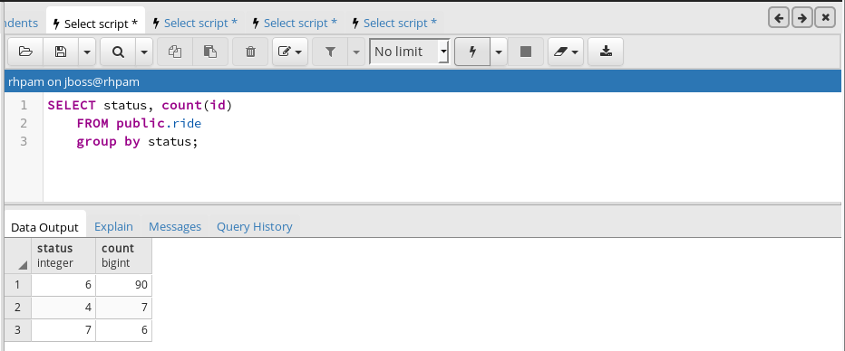

. The dispatch service and the passenger service use shared, durable topic subscriptions. This means they can be scaled up and down without issues.
* Scale down the dispatch server to 0 pods
+
----
$ oc scale dc dispatch-service --replicas=0 -n $SERVICES_PRJ
----
* Call the passenger service REST API:
+
----
$ curl -X POST -H "Content-type: application/json" -d '{"messages": 10, "type": 0}' $PASSENGER_SERVICE_URL/simulate
----
* Scale up the dispatch service.
+
----
$ oc scale dc dispatch-service --replicas=1 -n $SERVICES_PRJ
----
* Follow the logs of the dispatch service. Note that after starting up the dispatch service starts to consume the messages sent to the `topic-ride-event` topic while the service was down.
* Scale up the dispatch service to 2 pods
+
----
$ oc scale dc dispatch-service --replicas=2 -n $SERVICES_PRJ
----
* Call the passenger service REST API:
+
----
$ curl -X POST -H "Content-type: application/json" -d '{"messages": 1, "type": 1}' $PASSENGER_SERVICE_URL/simulate
----
* Check the logs of the dispatch server, notice that the `RideRequestedEvent` message and following messages is being consumed on only 1 node.
* Send a bunch of messages. Check the logs and notice that message handling is distributed over the dispatch service pods.

== Tracing

Our application is working fine, but there is definitively a lack in observability and traceability of what's going on in the system. The message flows in a real-life system will be way more complex than the small demo application we have so far.

That is where distributed tracing can help. As the name implies, distributed tracing provides the capability to be able to follow requests or messages as they flow through the distributed appllication. It helps with the diagnosis of issues, performance bottlenecks and application behaviour.

To enable distributed tracing, the application code is instrumented to assign a unique trace ID to each external request. That trace Id is passed along to all services that participate in the handling of the request. Each individual service in the request handling chain adds a new span to the trace. A span is a logical unit of work in a distributed system. A span has a name, start date and a duration and can be enriched with additional information in the forms of tags, which can have technical or business relevance. Spans can have relationships with other spans, such as `child-of` or `follows-from`. Span data is collected by or sent to a central aggregator for storage, visualization and analytics.

The https://opentracing.io[OpenTracing API] is a vendor neutral, open standard for tracing. It is supported across many languages (Java, JavaScript, Go, ...) and provides a growing number of tracer implementations and framework integrations.

https://www.jaegertracing.io[Jaeger] is an open source implementation of the OpenTracing API, originally developed and open-sourced by Uber. Jaeger is a CNCF (Cloud Native Computing Foundation) hosted project. Red Hat is an active contributor to the project.

Enabling tracing requires instrumentation of the application code. However, more and more integration projects become available that integrate OpenTracing with technologies (servlet, JAX-RS, JMS, ...), frameworks (Spring, ...) and products (Kafka, Redis, ElasticSearch, ...),. These integrations minimize the need for adding tracing instrumentation to the application code itself.

In this lab we will add tracing to the message producers and consumers in the application services. This will give us an overall view of the message flow throughout the system.

=== Code Walkthrough

==== Spring Boot - Dispatch service and Passenger service

The OpenTracing _contrib_ projects contains a large number of libraries providing integration of OpenTracing with a plethora of technologies and frameworks. +
Amongst these libraries are `opentracing-jms-2` and `opentracing-jms-spring`. These libraries provide instrumented versions of `javax.jms.MessageProducer` and `javax.jms.MessageListener` which add tracing spans to outgoing and incoming JMS messages. The `opentracing-jms-spring` library integrates with the Spring Boot and Spring JMS components. If these libraries are present on the classpath, the instrumented versions will be used, providing tracing functionality without the need to explicitly add tracing information in the code.

* The tracing information is added as JMS headers to JMS messages
* For every incoming message, a new span is created. If the incoming message has tracing headers, the trace information is extracted and added to the new span as parent span. The span becomes the active span.
* For every outgoing message, a new span is created. If there is an active span, it is added to the new span as parent span. The span info is serialized and added to the JMS headers of the message.
* OpenTracing requires a concrete OpenTracing implementation, in casu Jaeger.
* Jaeger is initialized in the `com.acme.ride.passenger.tracing.JaegerTracerConfiguration` class.
* The `opentracing-jms-spring` library is compatible with JMS 1.1, but the Dispatch and Passenger services use JMS 2.0. This means you have to provide and configure a JMS 2.0 compatible version of the `TracingJmsTemplate` class. See `com.acme.ride.passenger.tracing.TracingJmsConfiguration` and `com.acme.ride.passenger.tracing.TracingJmsTemplate` for details.
* In the Passenger service, an initial span is created for every `RideRequestedEvent` message sent. This span acts as parent span for all subsequent message exchanges and allows to follow the message flow throughout the system.
+
----
    Scope scope = tracer.buildSpan("RideRequested").ignoreActiveSpan()
        .withTag(Tags.SPAN_KIND.getKey(), "RideRequest")
        .withTag("msgTraceId", message.getTraceId())
        .startActive(true);
----

==== Vert.x - Driver service

Vert.x provides some integration with OpenTracing, but only for the Vert.x Web component, not for the Vert.x AMQP bridge or the Vert.x event bus. +
This means that the application code needs to be instrumented to provide tracing functionality.

* The Jaeger tracer is initialized in `MainVerticle`.
* When the `MessageConsumerVerticle` receives a `AssignDriverCommand` message, the span information is extracted from the incoming AMQP message and a new span is created with the extracted span as parent span.
+
----
Scope scope = TracingUtils.buildFollowingSpan(msgBody, tracer);
----
+
----
    public static Scope buildFollowingSpan(JsonObject message, Tracer tracer) {

        SpanContext context = extract(message, tracer);

        if (context != null) {
            Tracer.SpanBuilder spanBuilder = tracer.buildSpan(OPERATION_NAME_RECEIVE)
                    .ignoreActiveSpan()
                    .withTag(Tags.SPAN_KIND.getKey(), Tags.SPAN_KIND_CONSUMER);

            spanBuilder.addReference(References.FOLLOWS_FROM, context);
            Scope scope = spanBuilder.startActive(true);
            Tags.COMPONENT.set(scope.span(), COMPONENT_NAME);
            return scope;
        }

        return null;
    }

    public static SpanContext extract(JsonObject message, Tracer tracer) {
        SpanContext spanContext = tracer.extract(Format.Builtin.TEXT_MAP, new AmqpTextMapExtractAdapter(message));
        if (spanContext != null) {
            return spanContext;
        }

        Span span = tracer.activeSpan();
        if (span != null) {
            return span.context();
        }
        return null;
    }
----
* The current span is stored as a `ThreadLocal` variable. However, every verticle is executed in its own thread, which means that the current span context is lost when a message is sent over the Vert.x event bus to another verticle. This is solved by serializing the active span and attaching it as a header to the event bus message.
+
----
vertx.eventBus().<JsonObject>send("message-producer", message, TracingUtils.injectSpan(new DeliveryOptions(), tracer));
----
+
----
    public static DeliveryOptions injectSpan(DeliveryOptions options, Tracer tracer) {
        Span span = tracer.activeSpan();
        if (span != null) {
            options.addHeader("opentracing.span", span.context().toString());
        }
        return options;
    }
----
* In the `MessageProducerVerticle` the active span is extracted from the event bus message headers. A new span is created as a child span and added to the application properties section of the AMQP message.
+
----
    Span span = TracingUtils.buildAndInjectSpan(amqpMsg, tracer, msg);
    try {
        messageProducer.send(amqpMsg);
    } finally {
        span.finish();
    }
----

=== Jaeger on OpenShift

The Jaeger ecosystem consists of three components:

* jaeger-agent: a daemon program that runs on every host and receives tracing information submitted by applications via Jaeger client libraries.
* jaeger-collector: aggregator process responsible for collecting tracing information from the jaeger agents and persisting the information in a storage backend.
* jaeger-query: serves the API endpoints and the Jaeger UI.

Jaeger collectors require a persistent storage backend. Cassandra and ElasticSearch are the primary supported storage backends.

The Jaeger agent exposes a number of ports. The port to use depends on the protocol. By default, the Jaeger application client uses the _jaeger.thrift_ protocol and connects to the agent over UDP to port 6831.

The collector also exposes several ports. The Jaeger agent uses port 14267 over TCP to send spans in jaeger.thrift format.

In the lab we use a simplified deployment for Jaeger. We use the _all-in-one_ Jaeger image, which bundles the collector and the query component. The collector uses memory storage. This means that storage is not persistent and will be lost when the Jaeger pod disappears or is scaled down.

The Jaeger agent is deployed as a side-car container in the application pods. The default Jaeger protocol and ports are used.

=== Provision Jaeger

Jaeger is installed in the tools project.

. In a terminal, change directory to the folder where you cloned the `installation` project of the lab material.
. Review the template at `openshift/jaeger/jaeger-all-in-one.yaml`:
* The three Jaeger components (Agent, Collector and Query Agent) run in one single pod.
* The template defines three services, one for each component
* The template defines a route for the Jaeger UI
. Deploy Jaeger to the tools project
+
----
$ oc process -f openshift/jaeger/jaeger-all-in-one.yaml | oc create -f - -n $TOOLS_PRJ
----
. Get the URL for the `jaeger-query` route:
+
----
$ echo "https://$(oc get route jaeger-query -o jsonpath='{.spec.host}' -n $TOOLS_PRJ)"
----
. Wait until the jaeger pod is up and running. In a browser window, navigate to the URL of the `jaeger-query` route. Expect to see the Jaeger UI landing page:
+
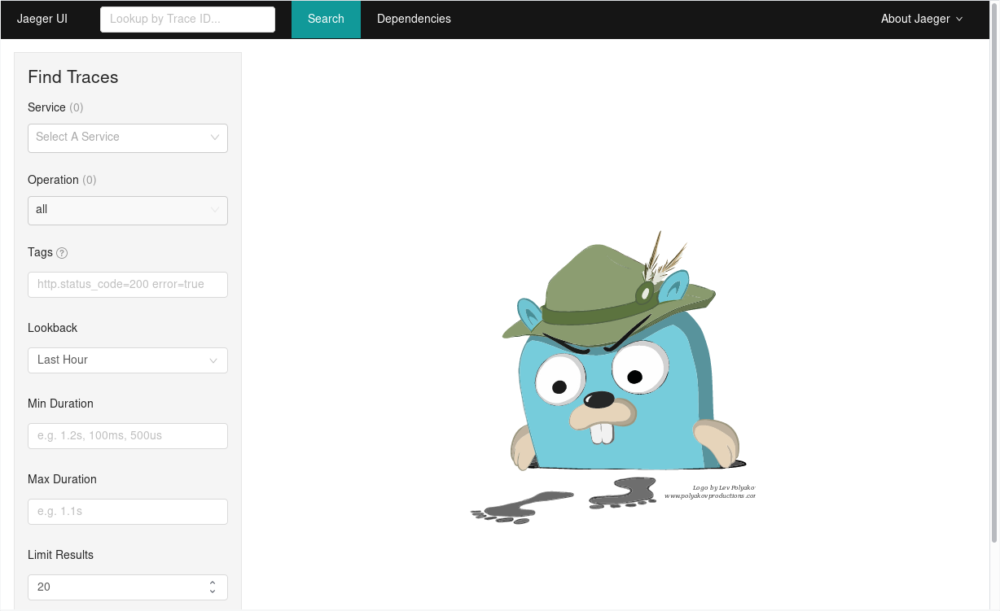

=== Add tracing to the Driver service

. In a terminal window on your workstation, change directory to the directory where you cloned the driver service source code from GitHub. +
Checkout the `tracing` branch, and push the branch to the gogs repository.
+
----
$ git checkout tracing
$ git push -u gogs tracing
----
. Add Jaeger tracing configuration to the driver service configmap.
* Change directory to the `etc` folder in the driver service source code project.
* Open the `application-config.yaml` file. Note the additional configuration at the bottom of the file:
+
----
service-name: driver-service
reporter-log-spans: false
sampler-type: ratelimiting
sampler-param: 1
# const
# sampler-type: const
# sampler-param: 1
agent-host: localhost
agent-port: 6831
----
** service-name: the name given to spans created in this application
** reporter-log-spans: if set to true, every span will be logged to the application log
** sampler-type: defines how sampling is done. Possible values are `const`, `probabilistic`, `rate-limiting` and `remote`.
*** const: samples all traces (sampler-param = 1) or none (sampler-param = 0)
*** rate-limiting: traces are sampled with a constant rate. For example, when sampler-param=2.0 it will sample requests with the rate of 2 traces per second.
*** probabilistic: the sampler makes a random sampling decision with the probability of sampling equal to the value of sampler-param property. For example, with sampler-param=0.1 approximately 1 in 10 traces will be sampled.
***  remote: the sampler consults Jaeger agent for the appropriate sampling strategy to use in the current service.
** agent-host: the host name or IP address where the Jaeger agent runs.
** agent-port: the port the Jaeger agent is listening to.
* Set the `amqp.host` property to the hostname of the EnMasse messaging service. Save the file.
* Delete the current configmap and create a new one from the `application-config.yaml` file.
+
----
$ oc delete configmap driver-service -n $SERVICES_PRJ
$ oc create configmap driver-service --from-file=application-config.yaml -n $SERVICES_PRJ
----
. Modify the build pipeline for the driver service to build from the tracing branch.
* In the OpenShift console, navigate to the tools project, and then to the `Builds -> Pipelines` pane. Click on the `Edit Pipeline` link of the `driver-service-pipeline` pipeline. An editor for the Jenkins file opens.
* At line 15, change the branch to build from `master` to `tracing`.
+
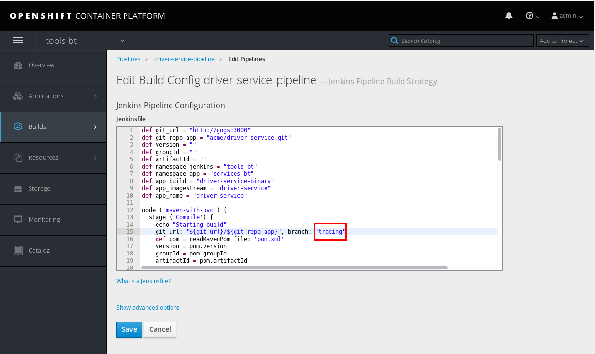
* Click `Save`.
. Trigger a new run of the pipeline. The pipeline should complete without errors.
. Replace the deploymentconfig of the driver service with a deploymentconfig that includes the Jaeger agent side-car container.
* In a terminal, change directory to the folder where you cloned the `installation` project of the lab material.
* Review the `openshift/driver-service/driver-service-tracing-template.yaml` template. +
Notice the second (side-car) container definition, named `jaeger-agent` and using the `jaegertracing/jaeger-agent` image. The agent is set up to transmit tracing samples to the jaeger-collector service on port 14267.
* Replace the deploymentconfig
+
----
$ oc delete dc driver-service -n $SERVICES_PRJ
$ oc process -f openshift/driver-service/driver-service-tracing-template.yaml -p APPLICATION_NAME=driver-service -p APPLICATION_CONFIGMAP=driver-service -p APPLICATION_TRUSTSTORE=enmasse-truststore -p JAEGER_COLLECTOR_NAMESPACE=$TOOLS_PRJ | oc create -f - -n $SERVICES_PRJ
----
. A new deployment of the driver service starts. Note that the pod consists of two containers.
+
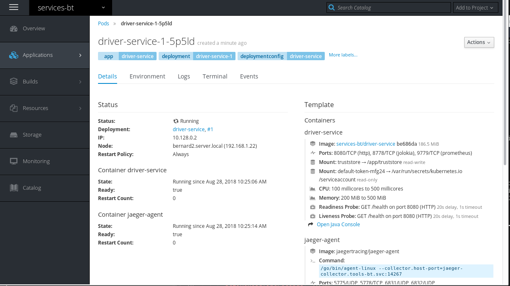
. Check the logs of the driver service container. Expect to see something like:
+
----
Starting the Java application using /opt/run-java/run-java.sh ...
exec java -Dapplication.configmap=driver-service -Dvertx.logger-delegate-factory-class-name=io.vertx.core.logging.SLF4JLogDelegateFactory -Xms63m -Xmx250m -XX:+UnlockExperimentalVMOptions -XX:+UseCGroupMemoryLimitForHeap -XX:+UseParallelOldGC -XX:MinHeapFreeRatio=10 -XX:MaxHeapFreeRatio=20 -XX:GCTimeRatio=4 -XX:AdaptiveSizePolicyWeight=90 -XX:MaxMetaspaceSize=100m -XX:ParallelGCThreads=1 -Djava.util.concurrent.ForkJoinPool.common.parallelism=1 -XX:CICompilerCount=2 -XX:+ExitOnOutOfMemoryError -cp . -jar /deployments/driver-service-1.0-SNAPSHOT.jar
2018-08-28 08:25:08.965  INFO   --- [ntloop-thread-0] io.jaegertracing.Configuration           : Initialized tracer=Tracer(version=Java-0.27.0, serviceName=driver-service, reporter=CompositeReporter(reporters=[RemoteReporter(queueProcessor=RemoteReporter.QueueProcessor(open=true), sender=UdpSender(udpTransport=ThriftUdpTransport(socket=java.net.DatagramSocket@1a2d5144, receiveBuf=null, receiveOffSet=-1, receiveLength=0)), closeEnqueueTimeout=1000), LoggingReporter(logger=Logger[io.jaegertracing.reporters.LoggingReporter])]), sampler=RateLimitingSampler(maxTracesPerSecond=1.0, tags={sampler.type=ratelimiting, sampler.param=1.0}), ipv4=176160770, tags={hostname=driver-service-1-5p5ld, jaeger.version=Java-0.27.0, ip=10.128.0.2}, zipkinSharedRpcSpan=false, baggageSetter=io.jaegertracing.baggage.BaggageSetter@5b473695, expandExceptionLogs=false)
2018-08-28 08:25:09.672  INFO   --- [ntloop-thread-3] MessageProducer                          : AMQP bridge to messaging.enmasse-bt.svc.cluster.local:5671 started
2018-08-28 08:25:09.672  INFO   --- [ntloop-thread-2] MessageConsumer                          : AMQP bridge to messaging.enmasse-bt.svc.cluster.local:5671 started
2018-08-28 08:25:09.680  INFO   --- [ntloop-thread-0] c.acme.ride.driver.service.MainVerticle  : Verticles deployed successfully.
2018-08-28 08:25:09.680  INFO   --- [ntloop-thread-4] i.v.c.i.l.c.VertxIsolatedDeployer        : Succeeded in deploying verticle
----
. Check the logs of the jaeger-agent container. Expect to see something like:
+
----
{"level":"info","ts":1535444714.1444583,"caller":"tchannel/builder.go:94","msg":"Enabling service discovery","service":"jaeger-collector"}
{"level":"info","ts":1535444714.1449552,"caller":"peerlistmgr/peer_list_mgr.go:111","msg":"Registering active peer","peer":"jaeger-collector.tools-bt.svc:14267"}
{"level":"info","ts":1535444714.145469,"caller":"agent/main.go:62","msg":"Starting agent"}
{"level":"info","ts":1535444715.1451674,"caller":"peerlistmgr/peer_list_mgr.go:157","msg":"Not enough connected peers","connected":0,"required":1}
{"level":"info","ts":1535444715.1454852,"caller":"peerlistmgr/peer_list_mgr.go:166","msg":"Trying to connect to peer","host:port":"jaeger-collector.tools-bt.svc:14267"}
{"level":"info","ts":1535444715.1478477,"caller":"peerlistmgr/peer_list_mgr.go:176","msg":"Connected to peer","host:port":"[::]:14267"}
----

=== Add tracing to the Passenger service

The steps to follow are essentially the same as for the driver service.

. In a terminal window on your workstation, change directory to the directory where you cloned the passenger service source code from GitHub. +
Checkout the `tracing` branch, and push the branch to the gogs repository.
+
----
$ git checkout tracing
$ git push -u gogs tracing
----
. Add Jaeger tracing configuration to the passenger service configmap.
* Change directory to the `etc` folder in the passenger service source code project.
* Open the `application.properties` file. Note the additional configuration at the bottom of the file:
+
----
jaeger.service-name=passenger-service
jaeger.sampler-type=ratelimiting
jaeger.sampler-param=1
# const
# jaeger.sampler-type=const
# jaeger.sampler-param=1
jaeger.reporter-log-spans=false
jaeger.agent-host=localhost
jaeger.agent-port=6831
----
+
Refer to the previous paragraph for details about these settings.
* Set the value of the `amqp.host` property to the hostname of the EnMasse messaging service. Save the file.
* Delete the current configmap and create a new one from the `application.properties` file.
+
----
$ oc delete configmap passenger-service -n $SERVICES_PRJ
$ oc create configmap passenger-service --from-file=application.properties -n $SERVICES_PRJ
----
. Modify the build pipeline for the passenger service to build from the tracing branch.
. Trigger a new run of the pipeline. The pipeline should complete without errors.
. Replace the deploymentconfig of the passenger service with a deploymentconfig that includes the Jaeger agent side-car container.
* In a terminal, change directory to the folder where you cloned the `installation` project of the lab material.
* Replace the deploymentconfig:
+
----
$ oc delete dc passenger-service -n $SERVICES_PRJ
$ oc process -f openshift/passenger-service/passenger-service-tracing-template.yaml -p APPLICATION_NAME=passenger-service -p APPLICATION_CONFIGMAP=passenger-service -p APPLICATION_TRUSTSTORE=enmasse-truststore -p JAEGER_COLLECTOR_NAMESPACE=$TOOLS_PRJ | oc create -f - -n $SERVICES_PRJ
----
. A new deployment of the passenger service starts. Note that the pod consists of two containers.
. Check the logs of the passenger service container. Scroll through the logs until you find the log entry for the configuration of the Jaeger tracer:
+
----
2018-08-28 07:54:34.446  INFO 1 --- [           main] io.jaegertracing.Configuration           : I
nitialized tracer=Tracer(version=Java-0.27.0, serviceName=passenger-service, reporter=CompositeRep
orter(reporters=[RemoteReporter(queueProcessor=RemoteReporter.QueueProcessor(open=true), sender=Ud
pSender(udpTransport=ThriftUdpTransport(socket=java.net.DatagramSocket@1807e3f6, receiveBuf=null,
receiveOffSet=-1, receiveLength=0)), closeEnqueueTimeout=1000), LoggingReporter(logger=Logger[io.j
aegertracing.reporters.LoggingReporter])]), sampler=RateLimitingSampler(maxTracesPerSecond=1.0, ta
gs={sampler.type=ratelimiting, sampler.param=1.0}), ipv4=176161276, tags={hostname=passenger-servi
ce-4-rm897, jaeger.version=Java-0.27.0, ip=10.128.1.252}, zipkinSharedRpcSpan=false, baggageSetter
=io.jaegertracing.baggage.BaggageSetter@480d3575, expandExceptionLogs=false)
----

=== Add tracing to the Dispatch service

. In a terminal window on your workstation, change directory to the directory where you cloned the dispatch service source code from GitHub. +
Checkout the `tracing` branch, and push the branch to the gogs repository.
+
----
$ git checkout tracing
$ git push -u gogs tracing
----
. Add Jaeger tracing configuration to the dispatch service configmap.
* Change directory to the `etc` folder in the dispatch service source code project.
* Open the `application.properties` file. Note the additional configuration at the bottom of the file:
* Set the value of the `amqp.host` property to the hostname of the EnMasse messaging service to the `amqp.host` property. Set the `postgresql.host` property to the host name of the PostgreSQL service. Save the file.
* Delete the current configmap and create a new one from the `application.properties` file.
+
----
$ oc delete configmap dispatch-service -n $SERVICES_PRJ
$ oc create configmap dispatch-service --from-file=application.properties -n $SERVICES_PRJ
----
. Modify the build pipeline for the dispatch service to build from the tracing branch.
. Trigger a new run of the pipeline. The pipeline should complete without errors.
. Replace the deploymentconfig of the dispatch service with a deploymentconfig that includes the Jaeger agent side-car container.
* In a terminal, change directory to the folder where you cloned the `installation` project of the lab material.
* Replace the deploymentconfig:
+
----
$ oc delete dc dispatch-service -n $SERVICES_PRJ
$ oc process -f openshift/dispatch-service/dispatch-service-tracing-template.yaml -p APPLICATION_NAME=dispatch-service -p APPLICATION_CONFIGMAP=dispatch-service -p APPLICATION_TRUSTSTORE=enmasse-truststore -p JAEGER_COLLECTOR_NAMESPACE=$TOOLS_PRJ | oc create -f - -n $SERVICES_PRJ
----
. A new deployment of the dispatch service starts. Note that the pod consists of two containers.
. Check the logs of the dispatch service container. Scroll through the logs until you find the log entry for the configuration of the Jaeger tracer:
+
----
2018-08-28 09:19:41.350 INFO 1 --- [ main] io.jaegertracing.Configuration : Initialized tracer=Tracer(version=Java-0.27.0, serviceName=dispatch-service, reporter=CompositeReporter(reporters=[RemoteReporter(queueProcessor=RemoteReporter.QueueProcessor(open=true), sender=UdpSender(udpTransport=ThriftUdpTransport(socket=java.net.DatagramSocket@45e6d1e0, receiveBuf=null, receiveOffSet=-1, receiveLength=0)), closeEnqueueTimeout=1000), LoggingReporter(logger=Logger[io.jaegertracing.reporters.LoggingReporter])]), sampler=RateLimitingSampler(maxTracesPerSecond=1.0, tags={sampler.type=ratelimiting, sampler.param=1.0}), ipv4=176160774, tags={hostname=dispatch-service-1-jzr4s, jaeger.version=Java-0.27.0, ip=10.128.0.6}, zipkinSharedRpcSpan=false, baggageSetter=io.jaegertracing.baggage.BaggageSetter@61db86bf, expandExceptionLogs=false)
----

=== Tracing in action

. In a terminal window, use curl to call the REST endpoint of the passenger service:
+
----
$ curl -X POST -H "Content-type: application/json" -d '{"messages": 1, "type": 1}' $PASSENGER_SERVICE_URL/simulate
----
. Wait a couple of seconds for the dispatch process to complete. Navigate to the Jaeger UI in a browser window. In the left pane, select `passenger-service` in the `Service` drop down box. Click `Find Traces`. +
Expect to see one trace, generated from the REST call:
+
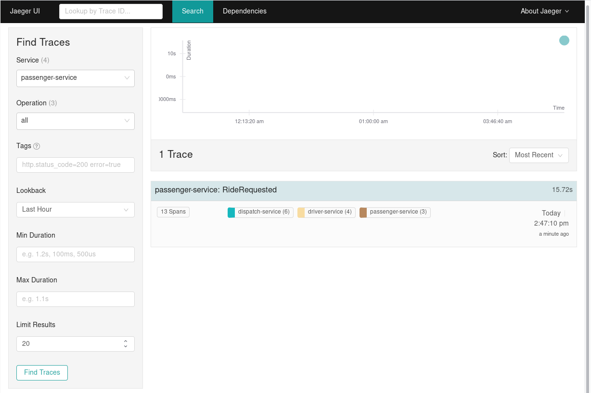
* the trace consists of 13 spans, divided over the three services of the application.
. Click on the span to see the different spans and their relationships:
+
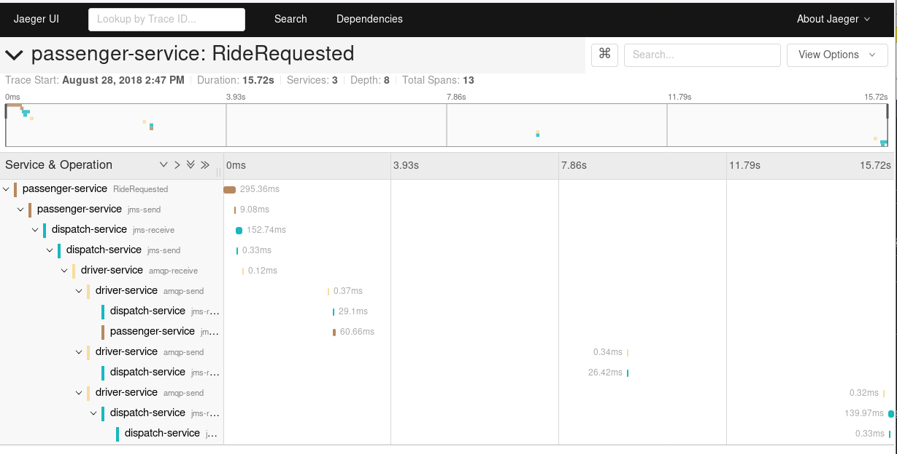
* The spans reflect the message flow throughout the system
* For JMS message senders, the duration is very short (couple of milliseconds or less), which is expected as the span wraps just the sending of the message.
* For JMS message consumers the span includes the code execution within the message listener implementation. For example, the first span in the dispatch service includes the creation, execution and persistence of the dispatch process.
. Click on a particular span to see the different tags and metadata attached to the span:
+
image::images/jaeger_trace_details_1.png[]
* Note the msgTraceId which was specifically added as a tag to the span in the implementation.
. In a terminal window, use curl to call the REST endpoint of the passenger service to send a request that will be cancelled by the passenger:
+
----
$ curl -X POST -H "Content-type: application/json" -d '{"messages": 1, "type": 2}' $PASSENGER_SERVICE_URL/simulate
----
. In the Jaeger UI, navigate to the landing page. Refresh the traces by clicking on the `Find Traces` button. Expect to see a second trace, with 10 spans. Click on the trace to see the details:
+
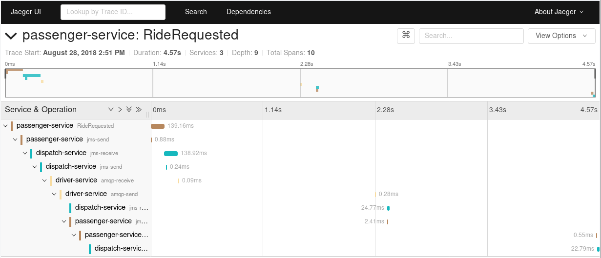
. In a terminal window, use curl to call the REST endpoint of the passenger service to send a request that will remain unassigned:
+
----
$ curl -X POST -H "Content-type: application/json" -d '{"messages": 1, "type": 3}' $PASSENGER_SERVICE_URL/simulate
----
. In the Jaeger UI, navigate to the landing page. Refresh the traces. Expect to see three traces. The most recent trace has where the with 10 spans.
+
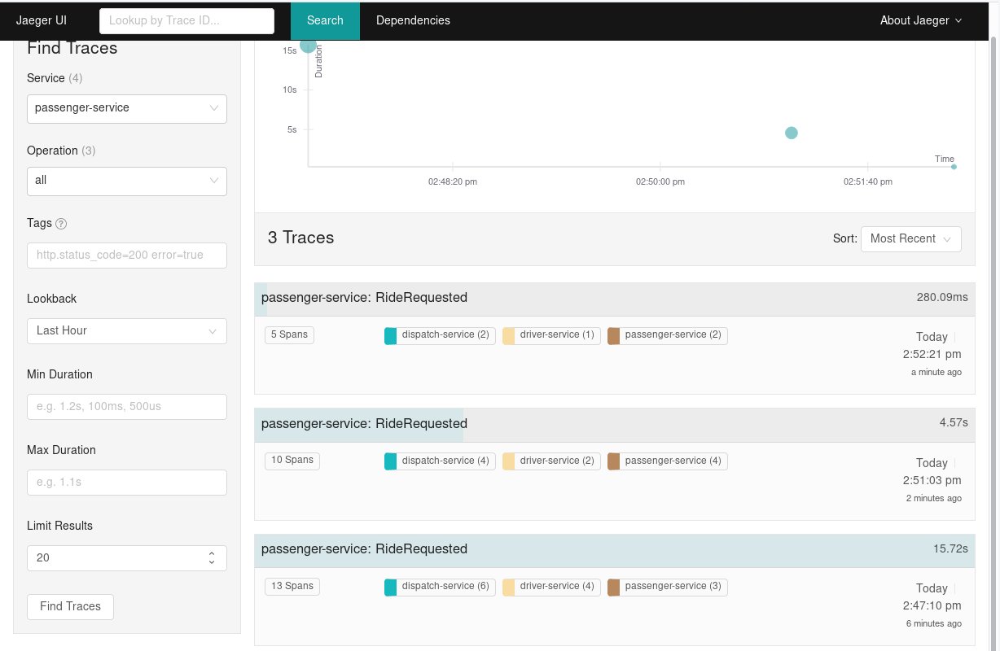
+
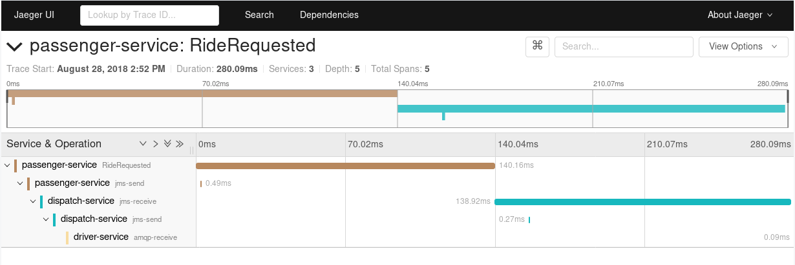

== Monitoring

Application performance monitoring is essential to be able to assert that your applications work and perform as expected and deliver the expected business value.

There are numerous tools and products on the market that provide monitoring capabilities at infrastructure and application level, both open-source and proprietary.

https://prometheus.io[Prometheus] is rapidly gaining traction as the open-source monitoring tool for cloud-native applications. Prometheus will be integrated into OpenShift to provide cluster-wide monitoring capabilities at the infrastructure level, but it is equally well suited for application-level monitoring.

The central component of Prometheus is the Prometheus server. The Prometheus server scrapes targets at a configurable interval to collect metrics from specific targets and store them in a time-series database. Targets—​the systems or applications that need to be monitored—​ typically expose an HTTP endpoint providing metrics. Prometheus has a wide range of service discovery options to find the target services and start retrieving metrics from them, including integration with OpenShift/Kubernetes.

The data gathered and stored by the Prometheus server can be queried using the PromQL language. The Prometheus UI has some limited capacities to show graphs from the collected metrics. Prometheus is often used together with https://grafana.com[Grafana] to provide dashboards on top of the metrics collected by Prometheus.

This diagram illustrates the architecture of Prometheus and some of its ecosystem components:

image::images/prometheus-architecture.svg[]

In this section of the lab you deploy Prometheus in your OpenShift environment, and configure it to scrape metrics from the EnMasse broker and the dispatch service.

=== Deploy Prometheus

. In a terminal, change directory to the folder where you cloned the `installation` project of the lab material.
. Create a service account for Prometheus in the tools project
+
----
$ oc create sa prometheus -n $TOOLS_PRJ
----
. The Prometheus service account requires view access rights to be able to use the Kubernetes/OpenShift API.
+
----
$ oc adm policy add-role-to-user view system:serviceaccount:$TOOLS_PRJ:prometheus -n $TOOLS_PRJ
----
. In order to discover services to monitor, the Prometheus service account also requires view access rights for the namespaces where the applications to be monitored are deployed.
+
----
$ oc adm policy add-role-to-user view system:serviceaccount:$TOOLS_PRJ:prometheus -n $ENMASSE_PRJ
$ oc adm policy add-role-to-user view system:serviceaccount:$TOOLS_PRJ:prometheus -n $SERVICES_PRJ
----
. Create a configmap with the Prometheus configuration file.
+
----
$ oc create configmap prometheus --from-file=openshift/prometheus/prometheus.yaml -n $TOOLS_PRJ
----
+
The configuration file is minimal at the moment. Scraping jobs will be added later on.
+
----
rule_files:
  - '*.rules'

# global config
global:
  scrape_interval:     30s # Set the scrape interval to every 15 seconds. Default is every 1 minute.
  evaluation_interval: 30s # Evaluate rules every 15 seconds. The default is every 1 minute.
  # scrape_timeout is set to the global default (10s).

scrape_configs:
----
. Review the template for depoyment of Prometheus at `openshift/prometheus/prometheus-template.yaml`.
* The template defines a route, a service and a deployment API object. The route allows access to the Prometheus UI web application.
* By default, the Prometheus UI web application is exposed over port 9090.
* The Prometheus image runs under the prometheus service account.
* The Prometheus metric data are stored on temporary storage on the pod’s node.
* The data retention time is set to 6 hours.
* The prometheus configmap is mounted inside the Prometheus pod in the etc/prometheus directory.
. Deploy Prometheus.
+
----
$ oc apply -f openshift/prometheus/prometheus-template.yaml -n $TOOLS_PRJ
----
. Get the URL for the `prometheus` route:
+
----
$ echo "http://$(oc get route prometheus -o jsonpath='{.spec.host}' -n $TOOLS_PRJ)"
----
. In a browser window, navigate to the URL of the `prometheus` route. Expect to see the Prometheus UI landing page:
+
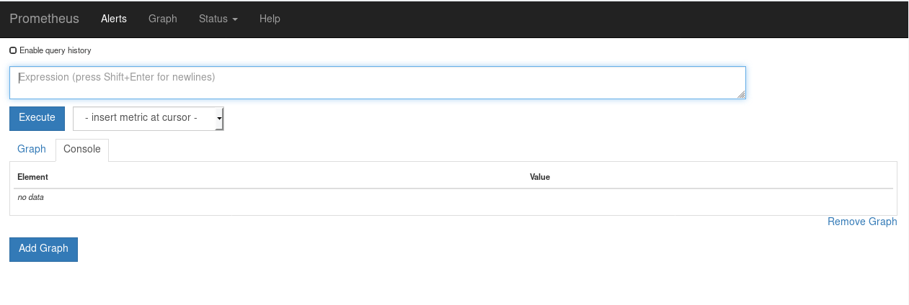

=== Monitor the EnMasse broker

. The EnMasse broker exposes Prometheus metrics at port 8080.
+
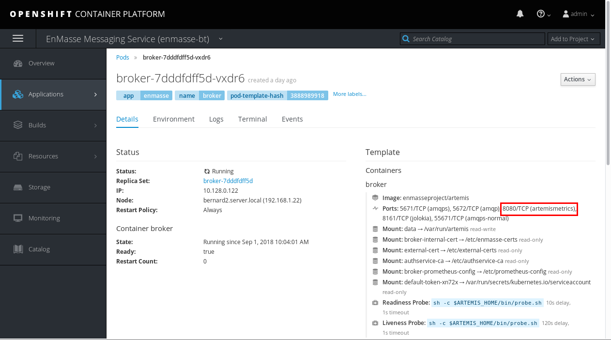
+
In the OpenShift console, navigate to the EnMasse broker pod, click on the `Terminal` tab and type `curl localhost:8080`. Expect to see the metrics exposed by the EnMasse broker in Prometheus format:
+
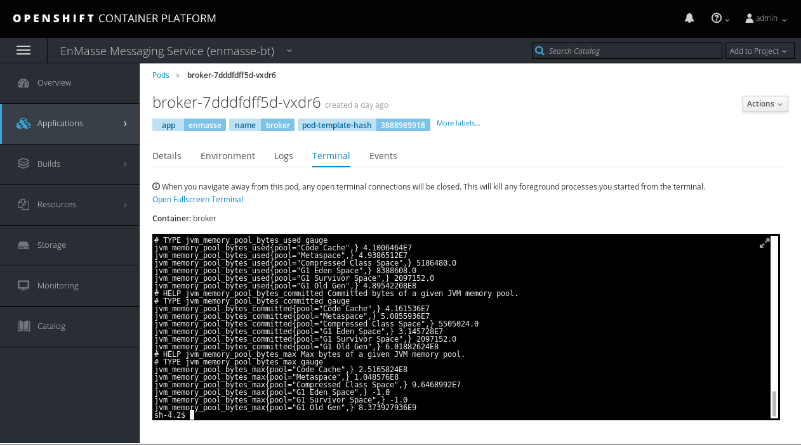
. Define a scrape job on Prometheus to scrape the EnMasse broker metrics. +
Open the `openshift/prometheus/prometheus.yaml` file in the `installation` project of the lab material in a text editor. Add the following contents to the file. Replace `<enmasse project>` with the name of OpenShift project where you deployed EnMasse.
+
----
scrape_configs:
- job_name: 'enmasse'
  kubernetes_sd_configs:
  - role: pod
    namespaces:
      names:
      - <enmasse project>

  relabel_configs:
  - source_labels: [__meta_kubernetes_pod_container_port_name]
    action: keep
    regex: artemismetrics.*
  - source_labels: [__meta_kubernetes_pod_name]
    action: replace
    target_label: kubernetes_pod_name
  - source_labels: [__meta_kubernetes_namespace]
    action: replace
    target_label: kubernetes_namespace
----
* For a detailed overview of the Prometheus configuration settings, refer to the https://prometheus.io/docs/prometheus/latest/configuration/configuration/[Prometheus configuration documentation]
* `scrape_configs` contains the configuration settings for the scraping jobs.
* There is one scraping job named `enmasse` with type `kubernetes_sd_configs`.
* Kubernetes SD configurations allow retrieving scrape targets from the Kubernetes REST API and always staying synchronized with the cluster state.
* A Kubernetes SD configuration has a role type to discover targets. Supported role types include node, pod, service, endpoint, ingress. The role type for the enmasse job is pod. The pod role discovers all pods and exposes their containers as targets. For each declared port of a container, a single target is generated.
* The `namespaces` configuration allows to restrict the discovery of targets to a specified set of namespaces. For the `enmasse` scraping job, the discovery is limited to the namespace of the Enmasse broker.
* `relabel_configs`: Relabeling is a powerful tool to dynamically rewrite the label set of a target before it gets scraped. Multiple relabeling steps can be configured per scrape configuration. They are applied to the label set of each target in order of their appearance in the configuration file. Please refer to the Prometheus documentation for full details. +
In short, the settings for the `enmasse` scraping job configure the job as follows:
** Only the `artemismetrics` port is scraped
** The `kubernetes_namespace` label is set to the value of the Kubernetes namespace of the discovered target. Labels help to select and filter metrics when building dashboards.
** The `kubernetes_pod_name` label is set to the name of the Enmasse broker pod.
. Replace the `prometheus` configmap with the modified file:
+
----
$ oc delete configmap prometheus -n $TOOLS_PRJ
$ oc create configmap prometheus --from-file=openshift/prometheus/prometheus.yaml -n $TOOLS_PRJ
----
. Scale the Prometheus pod up and down to force a restart of the Prometheus pod:
+
----
$ oc scale deployment prometheus --replicas=0 -n $TOOLS_PRJ && oc scale deployment prometheus --replicas=1 -n $TOOLS_PRJ
----
. In a browser window, navigate to the Prometheus UI. Go to `Status -> Targets`. Expect to see the EnMasse target:
+
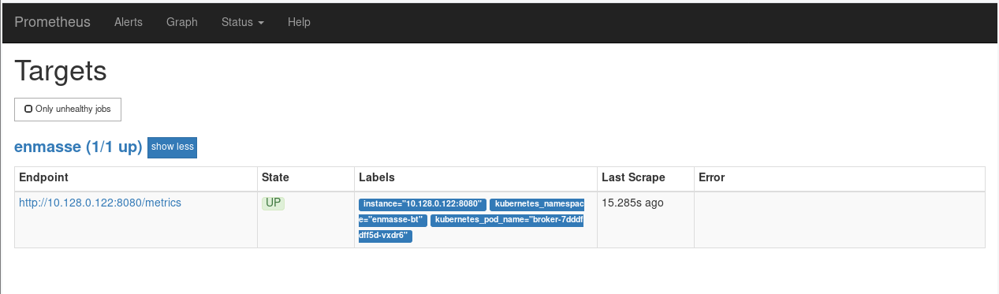
. On the Prometheus landing page, open the metric drop-down box to see an overview of the metrics exposed by the EnMasse broker:
+
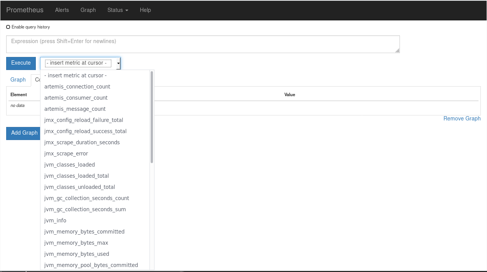
. Select the `artemis_consumer_count metric`. Click on 	`Execute`. Expect to see the number of consumers per topic:
+
image::images/prometheus_metrics_2.png[]
+
Click on the `Graph` tab to see a graphical representation of the metrics:
+
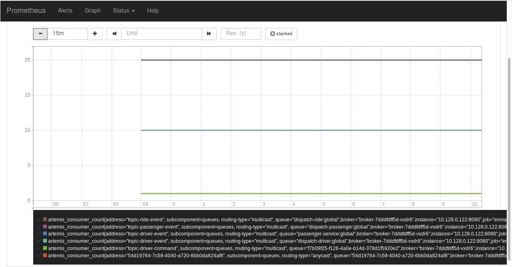
. Select the `artemis_message_count` metric. This metric returns the number of messages in a topic or queue that are not delivered to a consumer. The expected value is 0 for all the topics:
+
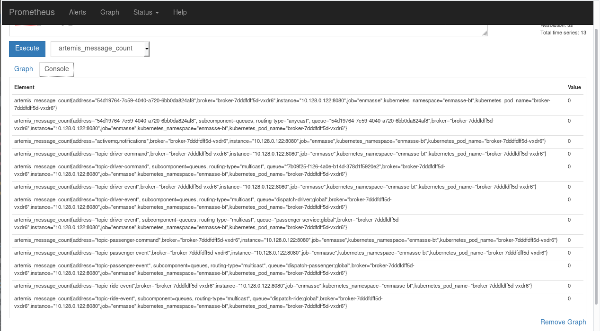
. To see the metrics in action, scale down the dispatch service to 0 replicas:
+
----
$ oc scale dc dispatch-service --replicas=0 -n $SERVICES_PRJ
----
. Wait until the dispatch service pod is terminated, and put some load on the system:
+
----
$ curl -X POST -H "Content-type: application/json" -d '{"messages": 100, "type": 0}' $PASSENGER_SERVICE_URL/simulate
----
. Observe the `artemis_message_count` metrics graph on the Prometheus console. The message count for the `topic-ride-event` topic goes up to 100:
+
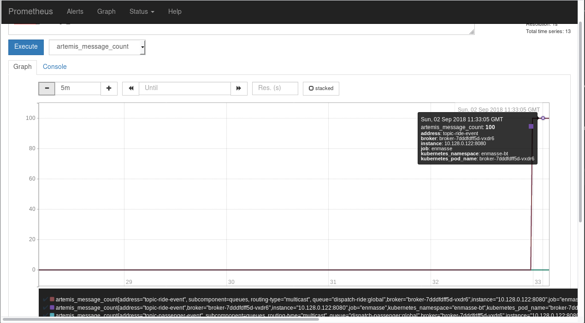
. Scale up the dispatch service to 1 replica:
+
----
$ oc scale dc dispatch-service --replicas=1 -n $SERVICES_PRJ
----
+
Observe how the message count for the `topic-ride-event` topic drops back to 0.

=== Monitor the dispatch service

Spring Boot apps expose MBeans which can be used to monitor the application performance. The Prometheus project provides a Java agent that can be deployed next to the application. The Java agent scans the MBeans, transforms the data they contain to Prometheus format, and exposes them on a HTTP endpoint using a built-in HTTP server on a different port than the application HTTP port (typically 9779). Note that the application container image needs to expose the Prometheus port. The `redhat-openjdk18-openshift` image used by the applications in this lab exposes port 9779.

In this section of the lab we leverage the Prometheus JMX Java agent to obtain metrics from the dispatch service.

. In a terminal, change directory to the folder where you cloned the `installation` project of the lab material.
. Create a configmap for the Prometheus Java agent.
+
----
oc create configmap dispatch-service-prometheus-agent --from-file=openshift/dispatch-service/prometheus-agent.yaml -n $SERVICES_PRJ
----
+
The configuration file looks like:
+
----
---
lowercaseOutputName: true
lowercaseOutputLabelNames: true
blacklistObjectNames: ["Tomcat:*","org.springframework.boot:*","org.springframework.cloud.context.restart:*"]
----
* lowercaseOutputName : lowercase the output metric name.
* lowercaseOutputLabelNames : lowercase the output metric label names
* blacklistObjectNames : A list of ObjectNames to not query. The dispatch service does not use the embedded Tomcat server except for the health endpoint, so Tomcat metrics are not very useful in our case.
. When building the image for the dispatch service, the Prometheus Java agent needs to be added to the image. That requires some changes to the build pipeline for the dispatch service, more specifically in the `Build Image` stage.
+
----
            stage ('Build Image') {
              // make directory for binary upload
              sh "mkdir -p xfer/prometheus"
              // cp application binary to xfer
              sh "cp target/${artifactId}-${version}.jar xfer"
              // download prometheus jmx agent from maven central
              sh "curl https://repo1.maven.org/maven2/io/prometheus/jmx/jmx_prometheus_javaagent/0.3.1/jmx_prometheus_javaagent-0.3.1.jar > xfer/prometheus/jmx_prometheus_javaagent.jar"
              openshift.withCluster() { // Use "default" cluster or fallback to OpenShift cluster detection
                def bc = openshift.selector("bc", "${app_build}")
                def builds = bc.startBuild("--from-dir=xfer")
                timeout (15) {
                  builds.watch {
                    if ( it.count() == 0 ) {
                      return false
                    }
                    // Print out the build's name and terminate the watch
                    echo "Detected new builds created by buildconfig: ${it.names()}"
                    return true
                  }
                  builds.untilEach(1) {
                    return it.object().status.phase == "Complete"
                  }
                }
              }
            }
----
. Deploy the modified pipeline to OpenShift
+
----
$ oc process -f openshift/dispatch-service/dispatch-service-monitoring-pipeline.yaml -p BC_NAME=dispatch-service-monitoring-pipeline -p GIT_URL=http://gogs:3000 -p GIT_REPO=acme/dispatch-service.git -p APP_BUILD=dispatch-service-binary -p APP_PROJECT=$SERVICES_PRJ -p JENKINS_PROJECT=$TOOLS_PRJ -p APP_IMAGESTREAM=dispatch-service -p APP_DC=dispatch-service | oc create -f - -n $TOOLS_PRJ
----
. Start the `dispatch-service-monitoring-pipeline` pipeline.
+
----
$ oc start-build dispatch-service-monitoring-pipeline -n $TOOLS_PRJ
----
+
Wait until the pipeline is completely executed.
. Replace the deploymentconfig of the dispatch service with a deploymentconfig that configures the Prometheus Java Agent.
* Review the deploymentconfig template at `openshift/dispatch-service/dispatch-service-tracing-monitoring-template.yaml`. Note the Prometheus Java agent configuration:
+
----
[...]
        containers:
        - env:
          - name: JAVA_OPTIONS
            value: >
              -javaagent:/deployments/prometheus/jmx_prometheus_javaagent.jar=9779:/prometheus-agent-config/prometheus-agent.yaml
              -Djavax.net.ssl.trustStore=/app/truststore/enmasse.jks
              -Djavax.net.ssl.trustStorePassword=password
              -Djavax.net.ssl.trustStoreType=JKS
              -Dorg.quartz.properties=/app/config/jbpm-quartz.properties
[...]
          volumeMounts:
          - mountPath: /app/truststore
            name: truststore
          - name: config
            mountPath: /app/config
          - name: prometheus-agent-config
            mountPath: /prometheus-agent-config
[...]
        volumes:
        - secret:
            defaultMode: 420
            secretName: ${APPLICATION_TRUSTSTORE}
          name: truststore
        - configMap:
            name: ${APPLICATION_CONFIGMAP}
          name: config
        - configMap:
            name: dispatch-service-prometheus-agent
          name: prometheus-agent-config
----
* Replace the depoymentconfig:
+
----
$ oc delete dc dispatch-service -n $SERVICES_PRJ
$ oc process -f openshift/dispatch-service/dispatch-service-tracing-monitoring-template.yaml -p APPLICATION_NAME=dispatch-service -p APPLICATION_CONFIGMAP=dispatch-service -p APPLICATION_TRUSTSTORE=enmasse-truststore -p JAEGER_COLLECTOR_NAMESPACE=$TOOLS_PRJ | oc create -f - -n $SERVICES_PRJ
----
* Check that the Prometheus Java agent is working correctly. +
In the OpenShift console, navigate to the dispatch service pod, click on the `Terminal` tab and type `curl localhost:9779`. Expect to see the metrics exposed by the application MBeans in Prometheus format:
+
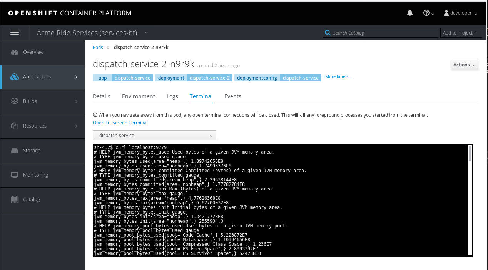

. Define a scrape job on Prometheus to scrape the dispatch service metrics. Open the `openshift/prometheus/prometheus.yaml` file in the `installation` project of the lab material in a text editor. Add the following contents to the end of the file. Replace `<services project>` with the name of OpenShift project where you deployed the dispatch service.
+
----
- job_name: 'dispatch-service'
  kubernetes_sd_configs:
  - role: endpoints
    namespaces:
      names:
      - <services project>

  relabel_configs:
  - source_labels: [__meta_kubernetes_service_annotation_prometheus_io_scrape]
    action: keep
    regex: true
  - source_labels: [__meta_kubernetes_service_annotation_prometheus_io_path]
    action: replace
    target_label: __metrics_path__
    regex: (.+)
  - source_labels: [__address__, __meta_kubernetes_service_annotation_prometheus_io_port]
    action: replace
    target_label: __address__
    regex: ([^:]+)(?::\d+)?;(\d+)
    replacement: $1:$2
  - source_labels: [__meta_kubernetes_namespace]
    action: replace
    target_label: kubernetes_namespace
  - source_labels: [__meta_kubernetes_service_name]
    action: replace
    target_label: kubernetes_name
----
* The role type for the scrape job is `endpoints`. The endpoints role discovers targets from listed endpoints of a Kubernetes service. For each endpoint address one target is discovered per port. If the endpoint is backed by a pod, all additional container ports of the pod, not bound to an endpoint port, are discovered as targets as well.
* A discovered endpoint requires an annotation `prometheus.io/scrape` set to true in order to be scraped.
* The `prometheus.io/path` annotation defines the path of the prometheus HTTP endpoint.
* The `prometheus.io/port` annotation defines the port of the prometheus HTTP endpoint.

. Replace the `prometheus` configmap with the modified file:
+
----
$ oc delete configmap prometheus -n $TOOLS_PRJ
$ oc create configmap prometheus --from-file=openshift/prometheus/prometheus.yaml -n $TOOLS_PRJ
----
. Patch the `dispatch-service` service to add the required annotations for the Prometheus scraping job:
+
----
$ oc patch service dispatch-service -p '{"metadata":{"annotations":{"prometheus.io/path":"/metrics","prometheus.io/port":"9779","prometheus.io/scrape":"true"}}}' -n $SERVICES_PRJ
----
. Scale the Prometheus pod up and down to force a restart of the Prometheus pod:
+
----
$ oc scale deployment prometheus --replicas=0 -n $TOOLS_PRJ && oc scale deployment prometheus --replicas=1 -n $TOOLS_PRJ
----
. In a browser window, navigate to the Prometheus UI. Go to `Status -> Targets`. Expect to see the dispatch service target:
+
image::images/prometheus_target_1.png[]
. On the Prometheus landing page, open the metric drop-down box to see an overview of the metrics exposed by the EnMasse broker and the dispatch service. Note that the dispatch service exposes metrics pertaining to the datasource connection pools (metrics starting with `org_apache_commons_dbcp2`)

=== SQL metrics

https://github.com/chop-dbhi/prometheus-sql[Prometheus SQL] is a service that generates basic metrics for SQL result sets and exposes them as Prometheus metrics. It executes SQL queries at a regular interval and exposes the resultset as Prometheus metrics.

In this section of the lab, we leverage Prometheus SQL to measure the number of `Ride` entities per status, as well as the number of process instances created.

. In a terminal, change directory to the folder where you cloned the `installation` project of the lab material.
. Review the Prometheus SQL configuration file at `openshift/prometheus-sql/prometheus-sql.yml`. The configuration defines the database(s) to connect to:
+
----
defaults:
  data-source: datasource
  query-interval: 30s
  query-timeout: 5s
  query-value-on-error: -1

# Defined data sources
data-sources:
  datasource:
    driver: postgresql
    properties:
      host: dispatch-service-postgresql
      port: 5432
      user: jboss
      password: jboss
      database: rhpam
      sslmode: disable
----
. The queries to execute are defined in the `openshift/prometheus-sql/queries.yml` file:
+
----
- ride_per_status:
    sql: >
        SELECT status, count(id) as cnt FROM ride GROUP BY status
    data-field: cnt
- ride_created:
    sql: >
        SELECT processname, count(1) as cnt FROM processinstancelog GROUP BY processname
    data-field: cnt
----
* `data-field` defines which column to expose as metrics.
* The Prometheus metrics are prefixed with `query_result_`.
. Create the configmap in the services project on OpenShift:
+
----
$ oc create configmap prometheus-sql-config --from-file=openshift/prometheus-sql/prometheus-sql.yml --from-file=openshift/prometheus-sql/queries.yml -n $SERVICES_PRJ
----
. Review the Prometheus SQL template at `openshift/prometheus-sql/prometheus-sql-template.yaml`.
. Deploy the Prometheus SQL image in the services project:
+
----
$ oc create -f openshift/prometheus-sql/prometheus-sql-template.yaml -n $SERVICES_PRJ
----
. Check the logs of the `prometheussql` pod. Expect to see something like:
+
----
2018/09/02 07:56:56 prometheus-sql starting up...
2018/09/02 07:56:56 Load config from file [/config/prometheus-sql.yml]
2018/09/02 07:56:56 Load queries from file [/config/queries.yml]
2018/09/02 07:56:56 * Listening on 0.0.0.0:8080...
[ride_per_status] 2018/09/02 07:56:56 Fetch took 27.982118ms
Creating ride_per_status{"status":6}
Creating ride_per_status{"status":7}
Creating ride_per_status{"status":4}
Registering metric ride_per_status{"status":4}
Registering metric ride_per_status{"status":7}
Registering metric ride_per_status{"status":6}
[ride_created] 2018/09/02 07:56:56 Fetch took 30.410054ms
Creating ride_created{"processname":"dispatch-process"}
Registering metric ride_created{"processname":"dispatch-process"}
[ride_per_status] 2018/09/02 07:57:26 Fetch took 788.363µs
[ride_created] 2018/09/02 07:57:26 Fetch took 2.983659ms
----

. Define a scrape job on Prometheus to scrape the SQL metrics. Open the `openshift/prometheus/prometheus.yaml` file in the `installation` project of the lab material in a text editor. Add the following contents to the end of the file. Replace `<services project>` with the name of OpenShift project where you deployed the dispatch service.
+
----
- job_name: 'dispatch-service-pgsql'
  kubernetes_sd_configs:
  - role: service
    namespaces:
      names:
      - services-bt

  relabel_configs:
  - source_labels: [__meta_kubernetes_service_annotation_prometheus_io_probe]
    action: keep
    regex: true
  - source_labels: [__meta_kubernetes_service_annotation_prometheus_io_path]
    action: replace
    target_label: __metrics_path__
    regex: (.+)
  - source_labels: [__meta_kubernetes_namespace]
    action: replace
    target_label: kubernetes_namespace
  - source_labels: [__meta_kubernetes_service_name]
    action: replace
    target_label: kubernetes_name
----
. Prometheus uses rule files to configure recording rules. Recording rules allow to precompute frequently needed or computationally expensive expressions and save their result as a new set of time series. Querying the precomputed result will then often be much faster than executing the original expression every time it is needed.
* As an example, let’s say you want to monitor the per-second rate of creation of dispatch process instances , as measured over the last 5 minutes. Using the Prometheus PromQL syntax, this can be expressed as:
+
----
rate(query_result_ride_created{processname="dispatch-process"}[5m])
----
* Review the recording rules file at `openshift/prometheus/dispatch-service.rules`:
+
----
groups:
- name: dispatch_service
  rules:
  - record: ride:requested:rate5m
    expr: rate(query_result_ride_per_state{state="1"}[5m])
  - record: ride:assigned:rate5m
    expr: rate(query_result_ride_per_state{state="2"}[5m])
  - record: ride:canceled:rate5m
    expr: rate(query_result_ride_per_state{state="4"}[5m])
  - record: ride:started:rate5m
    expr: rate(query_result_ride_per_state{state="5"}[5m])
  - record: ride:ended:rate5m
    expr: rate(query_result_ride_per_state{state="6"}[5m])
  - record: ride:expired:rate5m
    expr: rate(query_result_ride_per_state{state="7"}[5m])
  - record: ride:created:rate5m
    expr: rate(query_result_ride_created{processname="dispatch-process"}[5m])
----
. Replace the `prometheus` configmap with the modified `prometheus.yaml` and the `dispatch-service.rules` file:
+
----
$ oc delete configmap prometheus -n $TOOLS_PRJ
$ oc create configmap prometheus --from-file=openshift/prometheus/prometheus.yaml --from-file=openshift/prometheus/dispatch-service.rules -n $TOOLS_PRJ
----
. Scale the Prometheus pod up and down to force a restart of the Prometheus pod:
+
----
$ oc scale deployment prometheus --replicas=0 -n $TOOLS_PRJ && oc scale deployment prometheus --replicas=1 -n $TOOLS_PRJ
----
. In a browser window, navigate to the Prometheus UI. Go to `Status -> Targets`. Expect to see the `dispatch-service-pgsql` target:
+
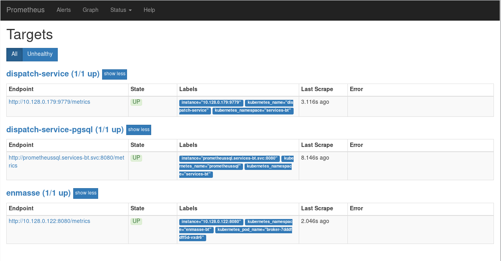
. In the Prometheus UI, navigate to `Status -> Rules`. Expect to see the rules defined in the `dispatch-service.rules` file:
+
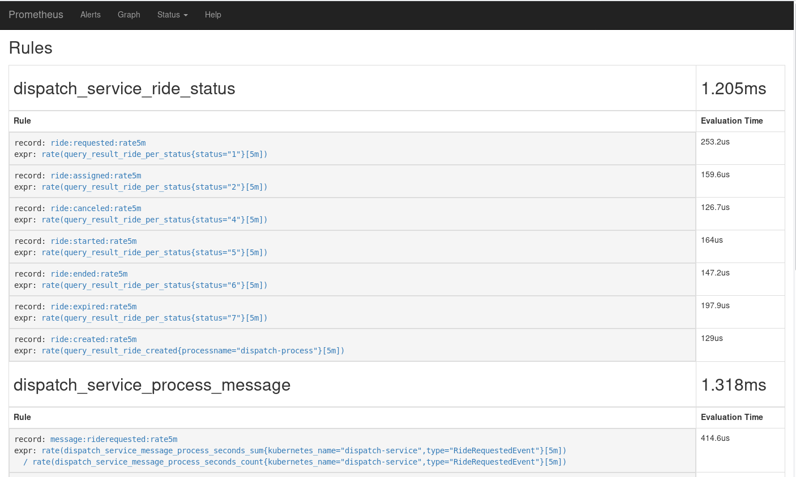
. In the Rules view click on one of the rules, for example `ride:created:5m`. The rule expression is copied into the metric box in the landing page and executed.
+
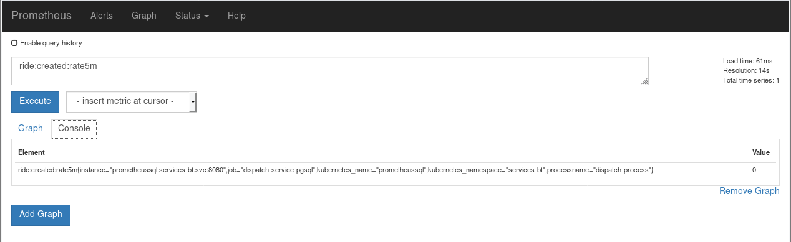
. Put some load on the system:
+
----
$ curl -X POST -H "Content-type: application/json" -d '{"messages": 500, "type": 0}' $PASSENGER_SERVICE_URL/simulate
----
. Observe the graph of the `ride:created:5m` - you need to click `Execute` to refresh the graph:
+
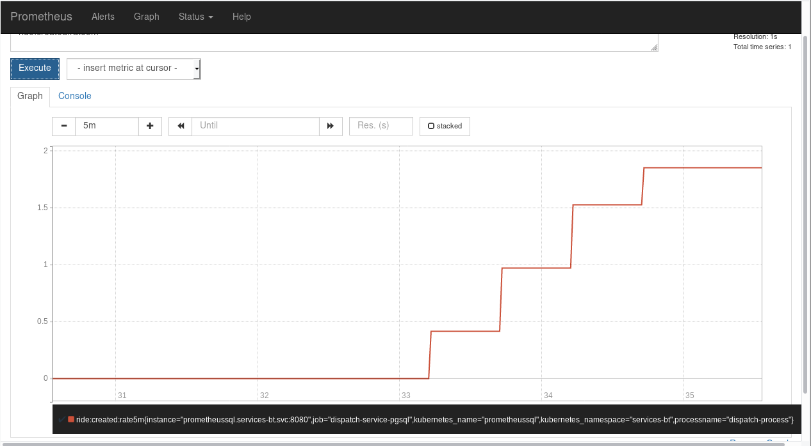

=== Grafana

The Prometheus UI capabilities to visualize metrics data are quite limited, that’s why Prometheus is often used in combination with Grafana to create dashboards.

In this section of the lab you deploy Grafana to OpenShift and create some dashboards based on metrics collected by Prometheus.

. In a terminal, change directory to the folder where you cloned the `installation` project of the lab material.
. Create a service account for Grafana in the tools project
+
----
$ oc create sa grafana -n $TOOLS_PRJ
----
. The `openshift/grafana` directory of the lab source material contains a Grafana configuration file named `defaults.ini`. Create a configmap from this file:
+
----
$ oc create configmap grafana-config --from-file=openshift/grafana/defaults.ini -n $TOOLS_PRJ
----
. Review the `openshift/grafana/grafana.yaml` template for Grafana.
* The template defines a route, a service and a deployment API object.
* By default, the Grafana UI web application is bound to port 3000.
* The Grafana image runs under the grafana service account.
* The Grafana data is stored on temporary storage on the pod’s node.
* The `grafana-config` configmap is mounted inside the Grafana pod in the `/root/go/src/github.com/grafana/grafana/conf` directory.
. Deploy Grafana to your OpenShift environment:
+
----
$ oc process -f openshift/grafana/grafana.yaml | oc create -f - -n $TOOLS_PRJ
----
. Get the URL for the Grafana route:
+
----
$ echo "http://$(oc get route grafana -o jsonpath='{.spec.host}' -n $TOOLS_PRJ)"
----
. In a web browser, navigate to the URL of the Grafana route. Expect to see the Grafana Homepage.
+
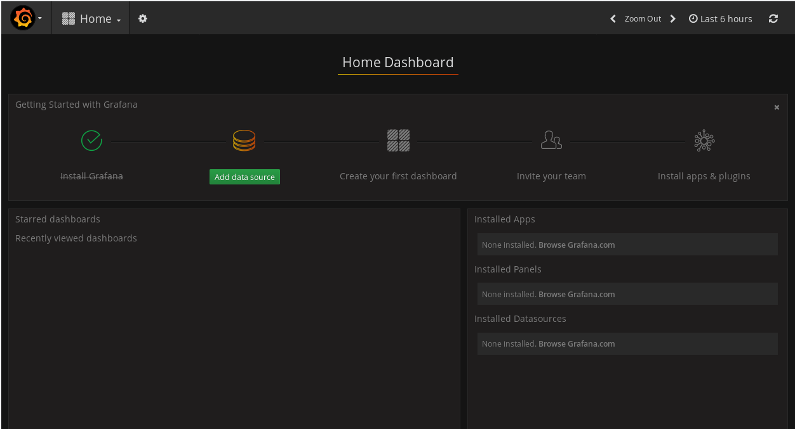
. Click on `Add data source` to configure a data source for Prometheus. On the `Add data source` page:
* Use `prometheus` as data source name.
* Choose `Prometheus` as data source type.
* The url should correspond to the Prometheus service URL, `http://prometheus:9090`.
* Leave the other settings as is.
* Click `add`. Expect to see a message that the data source is working. If not, verify and correct your input values.
* *Back on the Grafana home page, click on `New dashboard` to create a dashboard. Click on the graph icon. Expect to see an empty graph.
+
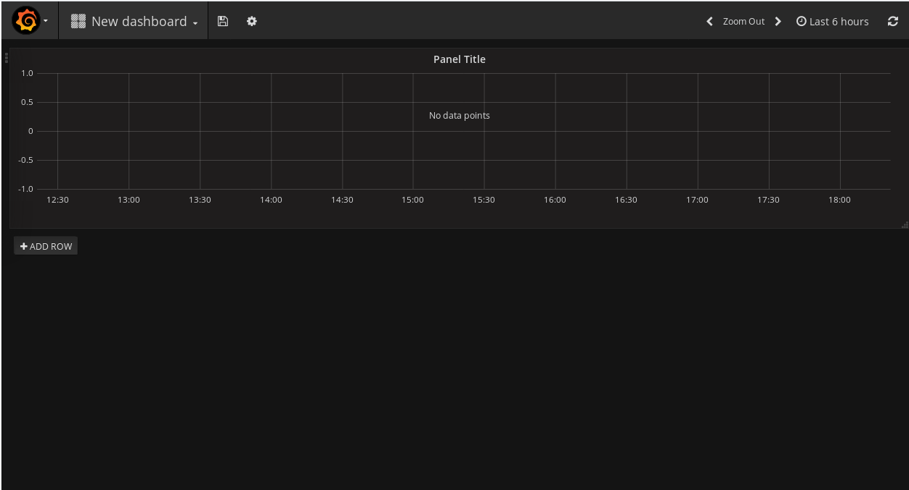
. Click on the `Panel title` link, and then on the `Edit` link. Expect the Graph edit page to appear:
+
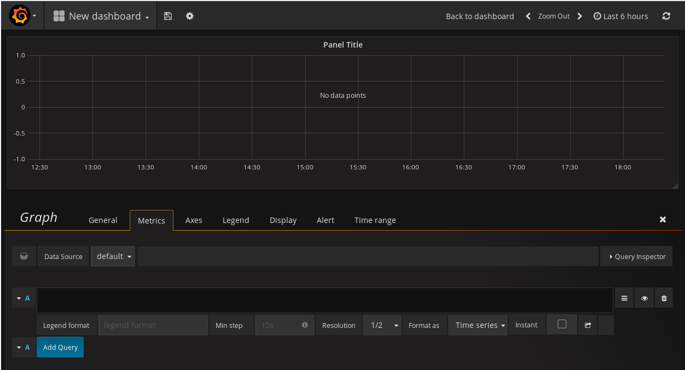
. On the `Metrics` tab, enter the query for the data. For example, to plot then number of messages in the EnMasse topics, enter `artemis_message_count{address="topic-driver-command"}`. Note that Grafana auto-suggests the metric names obtained from Prometheus. Set the `Legend format` to `topic-driver-command`.
+
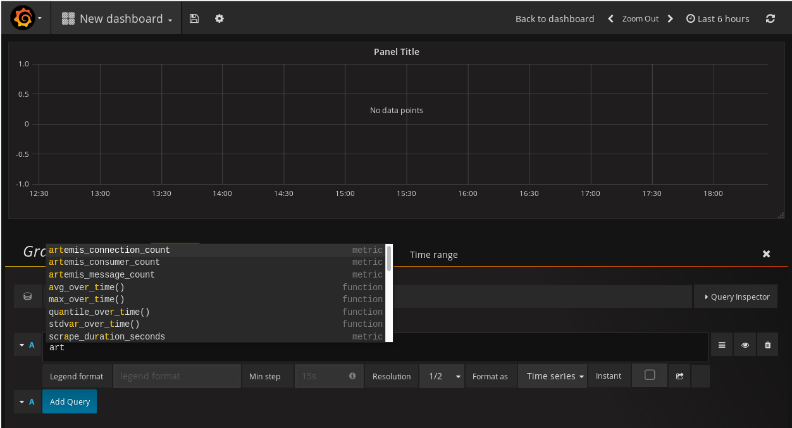
+
Repeat for the other topics.
+
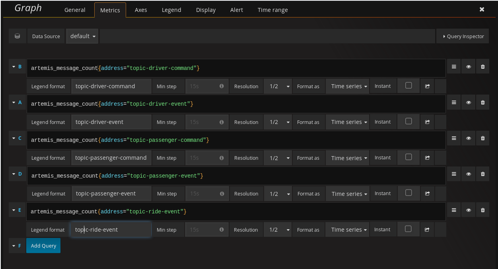
. Give a title to the graph in the `General` pane, and close the edit section.
. Create dashboard panes for metrics you are interested in. Suggested metrics are: the number of active connections in the datasource pools of the dispatch service (metrics start with `org_apache_commons_dbcp2`), JVM CPU and memory consumption for the dispatch service, The SQL metrics obtained from the dispatch service database.
+
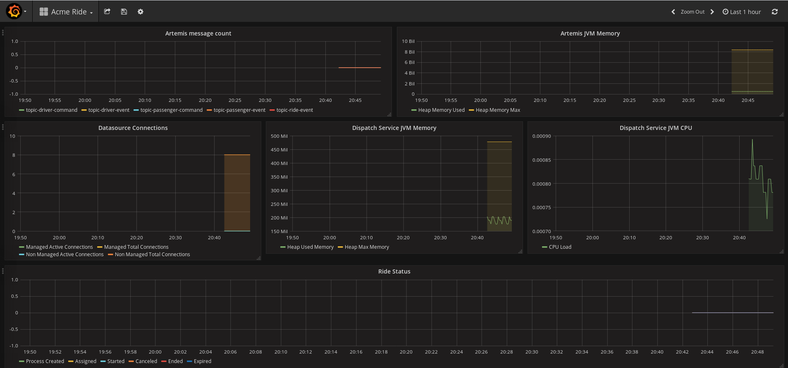
. Put some load on the system to generate data for the dashboard. If you have SoapUI installed on you system, the `soapui` project in the lab material has a SoapUI load test project.
* If needed, download and install SoapUI from https://www.soapui.org.
* Launch SoapUI, and open the project `acme-ride-soapui-project.xml` in the soapui project of the lab material.
* In the custom properties of the SoapUI project, set the value of the `OpenShiftEndpoint` property to the route URL of the passenger service application in OpenShift.
+
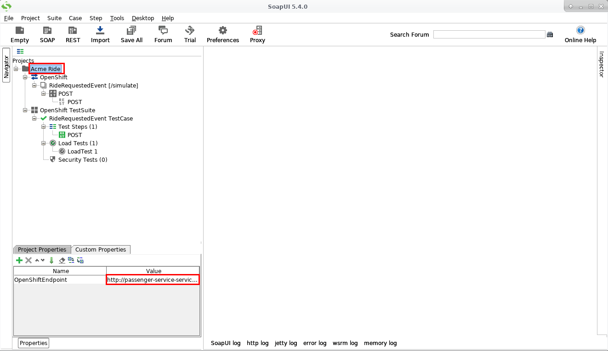
* In the Soapui project, navigate to the `LoadTest 1` load test. Open the load test and click on the green arrow icon to launch the test. This will generate approx 3 `RideRequestedEvent` messages per second during 5 minutes
+
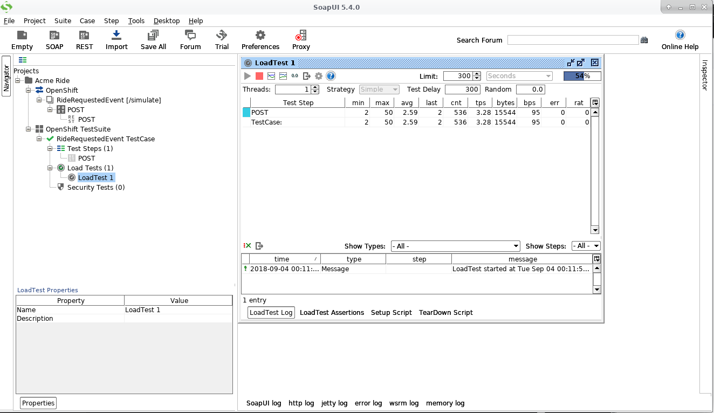
. Observe the Grafana console:
+
image::images/grafana_graph_5.png[]

Congratulations! You made it to the end of the lab.
